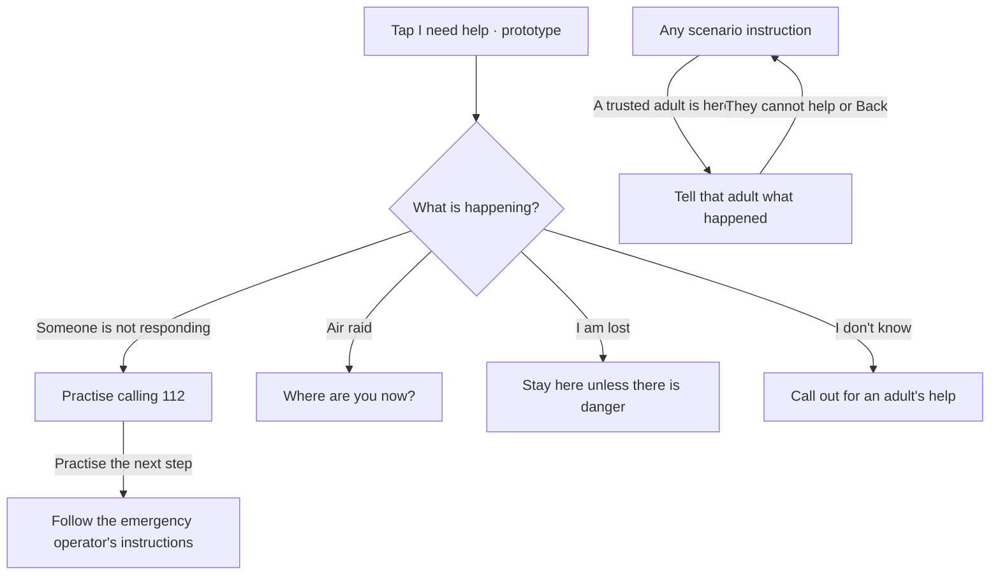
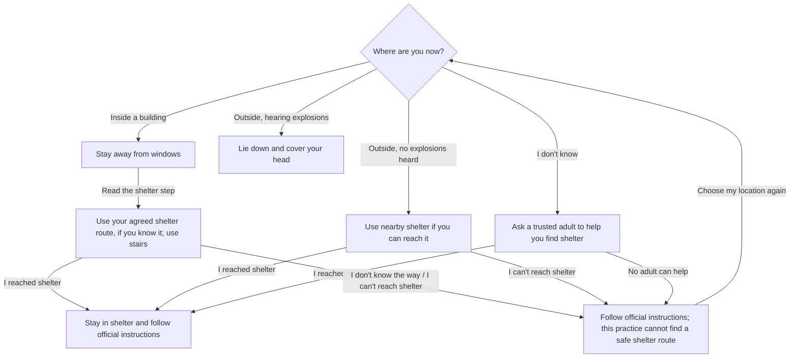
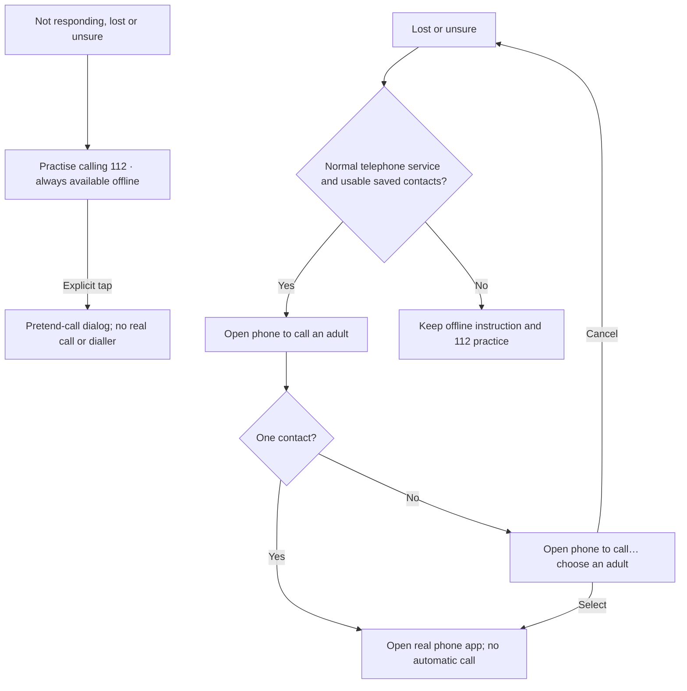

# “I need help” — decision diagram

Updated: 2026-10-04. Documents the implemented Android help prototype.

**Unreviewed prototype. Not for real emergencies.** This is not a validated emergency or medical protocol. See [EMERGENCY_HELP.md](EMERGENCY_HELP.md).

## Situation and helper decisions

Help opens directly on four situation choices. Adult support is optional on instruction screens, including shelter steps. It preserves the current scenario; **They cannot help** or Back returns to that instruction. It is absent from situation and air-location selection to keep those questions focused.

Practice calling and operator practice work with unknown or unavailable service. No call connection is claimed. The unresponsive-person content remains incomplete first aid.

## Air-raid decisions

No phone actions, shelter map or route calculation. GPS never answers the location question.

The fallback exposes the app's limit, not a new evacuation protocol or verified route. Adult support remains optional there. **I reached shelter** is self-reported. The explosion instruction retains Back and adult support; it does not imply that danger has ended.

## Phone actions

- Emergency-only, unknown and unavailable service hide real trusted-contact actions, never practice.
- Real contact actions are Android-only; web demo phone actions remain pretend.
- Helper, air-raid, situation and operator screens have no phone actions.
- Dialog/phone-launch failures are reported without triggering another action.
- Contact-read errors are distinct from no saved contacts.
- Telephone reports do not prove whether a call will connect.

## Back and location context

- Back follows history; Back from situation selection closes help and restores its opener.
- Adult support preserves the exact preceding instruction and removes phone actions while open.
- Help pauses map GPS and narration; closing requests a fresh map position when foreground. Map creation is deferred if help opens during loading.
- Optional **You may be near [name]. This is a saved place.** never chooses a branch or proves safety.
- No automatic calls, SMS, call-answer detection, verified shelter routes or dispatch.

## Implementation references

- [help_flow.dart](../mobile/lib/features/help/help_flow.dart): wording and transitions.
- [help_screen.dart](../mobile/lib/features/help/help_screen.dart): history and action visibility.
- [help_phone.dart](../mobile/lib/features/help/help_phone.dart): service, contacts and phone handoff.
- [SCREEN_FLOW.md](SCREEN_FLOW.md): implemented and future application flows.
