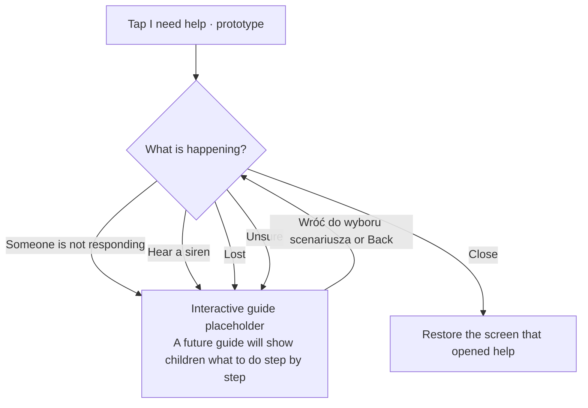

# “I need help” — decision diagram

Updated: 2026-10-04. Android and the browser demo share this flow.

**Feature in preparation. Not for real emergencies.**

The guide is not implemented. The help screen has no emergency instructions, phone actions, contact loading or GPS. See [EMERGENCY_HELP.md](EMERGENCY_HELP.md) and [SCREEN_FLOW.md](SCREEN_FLOW.md).
