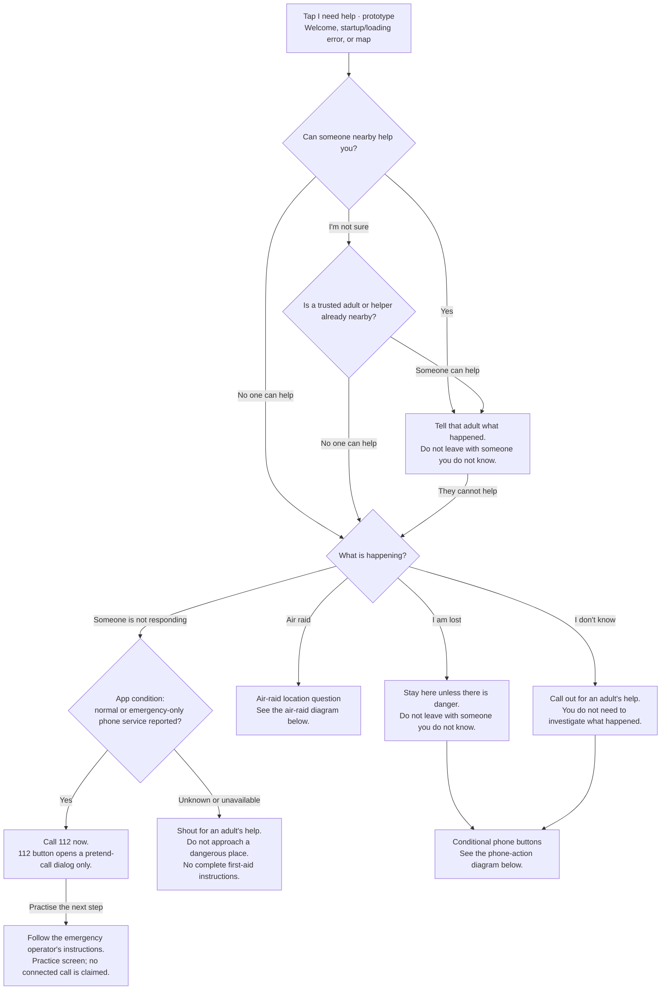
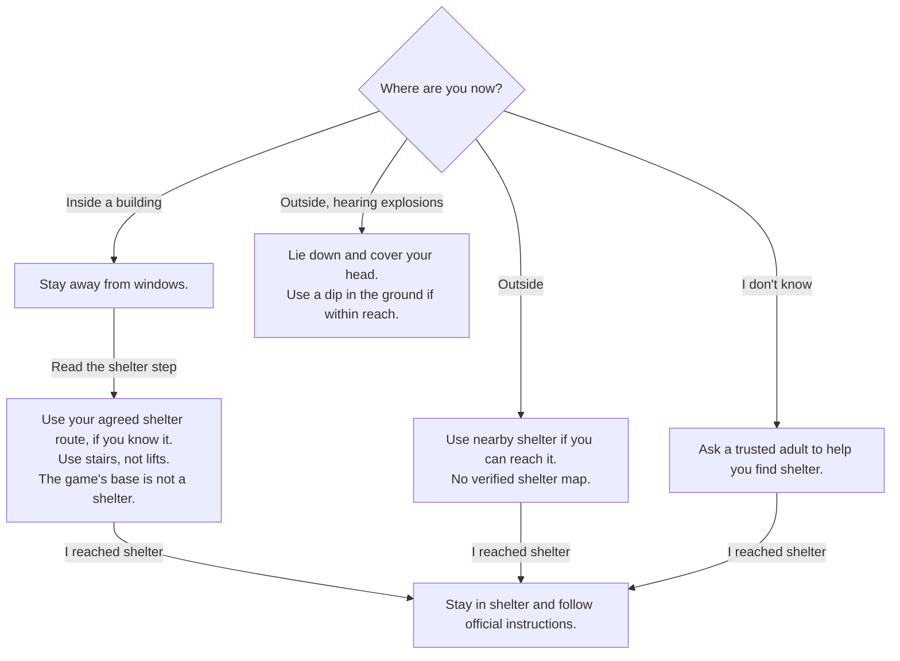
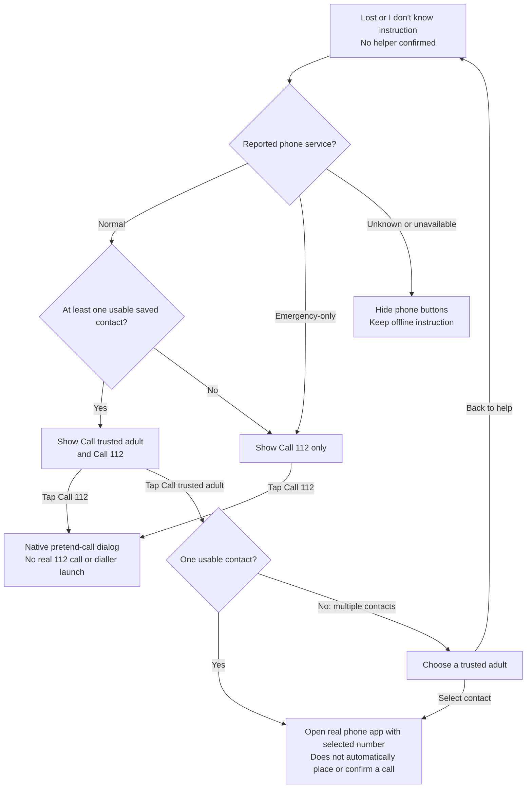

# “I need help” — decision diagram

Updated: 2026-10-03. Documents the implemented Android help prototype.

**Unreviewed prototype. Not for real emergencies.** These diagrams describe the app's current decisions and actions, not a validated emergency or medical protocol. The helper-first sequence and phone-service conditions are MVP showcase policy. See [EMERGENCY_HELP.md](EMERGENCY_HELP.md) for limitations and review requirements.

## Helper and situation decisions

Rectangles are screens or actions. Diamonds are questions; the phone-service diamond is an automatic app condition, not a question shown to the child. Arrow labels identify the selected answer or action.

The not-responding branch also follows the initial helper question. With unknown or unavailable service, its offline screen has neither a 112 button nor **Practise the next step**. Service changes update the current instruction and available actions without repeating the helper questions.

## Air-raid decisions

This branch has no phone buttons, shelter map or route calculation. The app asks the child where they are; GPS does not answer this question.

**I reached shelter** is the child's answer, not verified arrival. The explosion instruction has no subsequent scenario step; Back and the helper-return action remain available.

## Phone-action decisions

These conditions run automatically after no helper is confirmed. Offline instructions stay visible regardless of service. The buttons below are optional actions, not automatic calls or required next steps.

- Not responding offers only the 112 mock action when service is normal or emergency-only. It never offers trusted-contact buttons.
- Helper questions, adult support, situation selection, air-raid screens and operator practice have no phone buttons.
- A failed mock dialog reports that no call was made. A failed phone-app launch reports the failure and keeps offline steps available. Neither triggers another action automatically.
- A contact-read error is shown separately from having no usable contacts. Neither enables the trusted-contact button.
- Service is an Android telephone-service report, not an internet check or guarantee that calls can connect. Unknown service does not prove emergency calling is impossible.

## Back, helper return and location context

- **Back** returns to the preceding help screen. Back from the first helper question closes help and restores its opener.
- **Someone can help now** appears after no helper is confirmed on screens with fewer than three scenario choices. It returns to **Tell that adult what happened**, clears the earlier no-helper history and removes phone actions. It is absent from the four-choice situation and air-raid location questions. Back from adult support returns to the initial helper question.
- Opening help from the map pauses map GPS and narration. Closing help restores the opener and requests a fresh map position when foreground; opening during map loading defers map creation until help closes.
- Help may show **You may be near [name]. This is a saved place.** This optional GPS hint never chooses a branch, proves safety or directs the child to a pin. Instructions do not wait for GPS.
- No SMS, automatic calls, call-answer detection, verified shelter routes or rescue dispatch are implemented.

## Implementation references

- [help_flow.dart](../mobile/lib/features/help/help_flow.dart): screen wording and scenario transitions.
- [help_screen.dart](../mobile/lib/features/help/help_screen.dart): history, helper reset, service-dependent instructions and button visibility.
- [help_phone.dart](../mobile/lib/features/help/help_phone.dart): service states, usable contacts, 112 mock and trusted-contact handoff.
- [SCREEN_FLOW.md](SCREEN_FLOW.md): application-wide navigation, including implemented and future flows.
