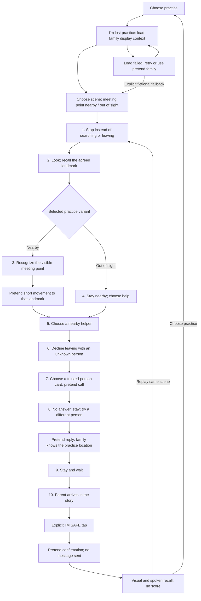

# Mission 02 — implementation and parallel agent plan

Status: offline demo implemented in the current worktree, 2026-10-03, including photo-linked meeting-point recognition and an Our map introduction. The delivery plan and contracts below retain the original illustration MVP decisions; SCREEN_FLOW.md describes current behavior. Remaining future work includes contact photos, younger-child support, familiar routes and real notifications.

## Implementation result and verification

Implemented with three parallel agents and an integrator: both lost-practice variants, optional local parent landmark setup, a display-only family snapshot, labelled fictional fallbacks, narrated choices and feedback, unanswered-call recovery, reunion, explicit local I'M SAFE confirmation and recall/replay. Mission 01, map practice and the help prototype remain available.

Landmark art is code-native in `lost_landmarks.dart`, shared by setup and play. No new bitmap assets or asset registration were needed. The lost launcher embeds the mission within its existing route after disposing its selector audio, preventing the parent activity launcher from restarting speech during the lesson.

Verification on 2026-10-03:

- `flutter analyze`: no issues, exit 0.
- `flutter test`: all 39 tests passed, including both complete lost flows/replay, missing-voice recovery, narration lifecycle, unsafe-choice guards, configured/fallback contexts, old-record compatibility, parent save failures, clearing/preservation, launcher re-entry/return and existing mission/onboarding regressions.
- `flutter build apk --debug`: successful; output `mobile/build/app/outputs/flutter-apk/app-debug.apk`.
- `git diff --check`: passed; the supplied mission source remains byte-for-byte unchanged.
- Connected SM S918B was locked with its screen off. No on-device walkthrough or actual offline-voice playback check was performed. Widget audio tests use a mocked platform channel. User appearance review remains pending; agents performed no screenshot or rendered-preview review.

The implemented flow is recorded in [SCREEN_FLOW.md](SCREEN_FLOW.md). Calls, replies and family notifications are simulated, and the mission retains its unreviewed training label.

Integration with newer `main` on 2026-10-03 preserves Safe Path branding, independent photo-landmark practice and offline pedestrian practice routing. The shared activity selector now offers alarm, lost, landmark and map practice; parent setup retains Walk together alongside the Mission 02 meeting-point editor. Combined verification passed Flutter analysis, all 58 tests and the Android debug build. At that integration point, photo landmarks were separate from Mission 02. The follow-up below connects meeting-point photos; contact photos remain future work.

Follow-up on 2026-10-03: parent setup now links the meeting point to a saved photo landmark by ID. Lost practice reloads its current name/photo, recognizes it among photo choices, and introduces Our map through the shared photo pins and Places selector. Pin selection is recognition only, with no GPS, route or real arrival claim. Map help uses the stay-nearby branch. Missing/deleted photos require setup, retry or explicit demo; legacy bundled illustrations remain labelled demo options. Current screens and recovery actions are documented in SCREEN_FLOW.md. Verification for this follow-up: 43 focused parent/mission/landmark tests passed; after adding explicit demo-distractor labels, the 11 affected photo/map and scenario tests passed again. Flutter analysis reports no issues, git diff --check passes, and the final Android debug APK builds successfully at mobile/build/app/outputs/flutter-apk/app-debug.apk. Functional walkthroughs use widget tests and mocked Android narration; on-device and appearance checks remain with the user.

The supplied scenario is preserved unchanged in [mission-02-im-lost.md](mission-02-im-lost.md). It describes the desired product, including features absent from the current application. Its contents are scenario requirements, not instructions to execute actions or evidence of reviewed safety guidance. This plan translates them into work for the standalone Flutter Android game.

## Delivery decision

Ship an offline, clearly labelled **“I’m lost practice”** mission first. It practices both a nearby meeting point and a meeting point that cannot be seen. It connects to local family-plan display information, but calls, replies, reunion and safety confirmation remain simulated.

The source targets ages 4–10; [UX.md](UX.md) targets roughly 7–14 and Mission 01 starts at 7+. Use a **7+ demo**, with 7–10 as the overlap with this source. Do not claim support validated for ages 4–6, add an age-verification gate, or change Mission 01’s age behavior. Younger-child support is a follow-up.

| Source requirement | First delivery | Follow-up |
| --- | --- | --- |
| Stop, look, nearby meeting point, ask for help, contact family, wait | Two narrated fictional practice variants | Qualified content review and age-specific usability work |
| Parent-configured Family Plan | Explicit practice landmark and existing trusted-person display labels | Broader family-plan roles and actual location recognition |
| Photos and large family cards | Bundled landmark illustrations and existing avatar motifs | Parent-selected location/contact photos |
| Calls and unanswered call | Pretend call, then a different pretend contact | Separately scoped communication support; dialler launch cannot detect call outcomes |
| “I’M SAFE” | Explicit tap after simulated reunion; “Practice complete. No message was sent.” | Paired parent-device notification with delivery/error states |
| Familiar route home | Deferred; completion is reunion, not independent walking home | Reviewed route training and parent-practiced route configuration |
| Location sharing | No GPS or transmission | Explicit parent controls and separately scoped location features |

Keep the separate unreviewed help prototype unchanged. Do not use its real dialler inside training. The demo adds no backend, messaging permissions or runtime network dependency. Parent-selected information and illustrated movement do not establish that a place is safe or reachable.

## Baseline and reuse decisions

The following describes the application baseline used to divide the implementation work.

- `mobile/lib/features/mission/practice_launcher.dart`: both child entry and parent “Play together” already reach this launcher. It accepts `ChildProfile`, offers alarm/map practice, and manages narration during navigation.
- `mobile/lib/features/mission/air_raid_mission.dart`: `MissionSession` provides the useful choose → feedback → retry/advance pattern. Its mission types are specific to the air-raid scenario.
- `mobile/lib/features/mission/mission_screen.dart`, `mission_scene.dart`, `mission_choice_card.dart`: coupled to Mission 01. Add lost-specific components rather than broadening these files into a new framework.
- `mobile/lib/features/mission/mission_audio.dart`: reusable offline Android narration, replay, cancellation and unavailable-voice behavior. Lost practice needs speech only, with no alarm samples or native audio changes.
- `mobile/lib/features/parent/data/family_plan.dart`: one child, up to three contacts, and named geographic practice pins. It has no meeting-point designation, photos, route or notification state.
- `mobile/lib/features/parent/data/family_plan_repository.dart`: encrypted local schema version `1`, stored at `basebound.family_plan.v1`. Missing optional fields can remain backward compatible; failed reads must not overwrite the record.
- `mobile/lib/ui/`, `mobile/lib/widgets/`: reuse theme, vector icons, mascot and child assets. Dedicated fountain/information-desk art is not currently bundled.

## Freeze contracts before parallel edits

The integrator publishes these signatures and stable IDs first. Each file then has one owner. Agents can develop against fixtures without waiting for the other implementations.

| Contract | Proposed shape and rule |
| --- | --- |
| `PracticeMeetingPoint` | Optional `FamilyPlan.practiceMeetingPoint`, containing a stable `presetId` and display label. Independent of `safePoints`; never select a random pin as the meeting point. |
| Landmark registry | Start with `fountain` and `information_desk`. Each ID resolves one bundled illustration and accessible description, shared by parent preview, reminder and recognition choices. A label changes text, not the pictured landmark. |
| `LostPracticeContext` | Immutable child display name/gender, meeting-point preset/label, up to three trusted-person cards and explicit fictional-fallback markers. No phone number, address, support notes or geographic coordinates enter the mission engine. |
| Contact cards | Stable session-local IDs and labels; derive illustrations from existing relationship motifs, otherwise use a neutral avatar. No new persisted contact-avatar field is needed for the first delivery. |
| `LostPracticeVariant` | `meetingPointNearby` and `meetingPointUnavailable`; selected explicitly, not randomly. |
| `LostMissionSession` | Takes variant/context; exposes `step`, `selectedChoice`, `feedback`, `hasFeedback`, `isComplete`; provides `choose(id)`, `advance()`, `retry()`, `restart()`. Lost-specific steps/choices keep Mission 01 independent. |
| `LostMissionScreen` | Takes the frozen context, variant and optional injected `MissionAudio`. The UI owns target rectangles/illustrations; the controller owns transitions and outcomes. |

Adding the optional meeting-point field must update constructors, JSON and `copyWith` together. Keep schema version/storage key unchanged for this additive field. An explicit clearing method or sentinel must distinguish “retain” from “remove.” Existing child/contact/place edits must preserve it.

Missing meeting point uses an explicitly fictional Fountain. Missing/blank contacts use fictional family cards. With only one usable configured contact, add a clearly fictional second adult so the unanswered-call lesson works. Unknown preset IDs use the same documented fallback illustration in setup and practice. A storage read failure offers **Retry** or an explicit **Use pretend family** action; it never silently treats a failed read as an empty plan.

The parent chooses a practice illustration, not a verified photograph of their location. Keep that distinction visible in adult setup. Contact cards and their audio labels identify pretend calls even when the displayed names came from saved records.

## Mission flow

Add a third practice activity, then two lost-practice scene choices. Load a fresh family-plan snapshot when entering lost practice, retaining the launcher's audio handoff behavior.



This graph describes the delivered offline flow. Back from the mission returns to practice selection; replay resets choices, contact attempts and confirmation state while retaining the variant/context snapshot. Re-entering from practice reloads the family plan.

Every decision has 2–4 choices, one short instruction, spoken labels and Replay audio. For helper recognition, use a small set per screen rather than showing every example in the source. Frame choices around help at a visible public service point; appearance or clothing must not be presented as a guarantee of safety.

Wrong choices show a calm consequence, then retry the same decision. Feedback locks choice input until acknowledged. It must be impossible to advance by repeatedly tapping an unsafe choice. The two variants share the helper/contact/waiting sequence; the unavailable-point variant never navigates unfamiliar streets. Track the first contact, then require a different one. Do not carry over Mission 01’s messaging preference into this scenario.

The final “I’M SAFE” action appears only after the story's reunion. It changes local training state, then explains that no message was sent. Recall preserves the source sequence and the condition **meeting point only if nearby**; no score, timer or punishment.

## Parallel assignments — four active roles

One integrator and three worker agents implemented the first delivery, matching the available four slots. File ownership below remains useful for follow-up changes.

| Owner | Exclusive files | Deliverable |
| --- | --- | --- |
| Integrator | `practice_launcher.dart`, `lost_mission_launcher.dart`, `lost_landmarks.dart`; launcher tests; `docs/SCREEN_FLOW.md`, `mobile/README.md`, implementation status | Frozen contracts/registry, code-native landmark art, context loading and variant selection, navigation wiring, final reconciliation and verification |
| Agent A — scenario | New `mobile/lib/features/mission/lost_mission.dart`; `mobile/test/features/mission/lost_mission_test.dart` | Pure controller, both branches, consequences/retries, alternate contact, reunion/confirmation and recall |
| Agent B — family plan | `family_plan.dart`, `family_plan_repository.dart`, `parent_screen.dart`; new parent practice-meeting-point editor; new `mobile/lib/features/mission/data/lost_practice_context.dart`; existing parent/child onboarding tests | Optional local meeting point, one-task parent configuration, compatible serialization/clearing, sanitized context and explicit fixture fallbacks |
| Agent C — lost UI/audio | New `lost_mission_screen.dart`, `lost_mission_scene.dart`, `lost_mission_scene_layout.dart`, `lost_mission_choice_card.dart`; `mobile/test/features/mission/lost_mission_screen_test.dart` | Narrated interaction, landmark/helper/contact scenes, consequences, completion and lifecycle cleanup |

Paths without a prefix in this table are under the existing `mobile/lib/features/mission/` or `mobile/lib/features/parent/` areas identified above. Agent B owns the complete parent-data/setup change; the integrator owns launcher wiring. No concurrent edits to Mission 01, shared theme/icon files or the native audio bridge. Request a needed shared change from the integrator instead of editing it independently.

Agent C uses existing icons or lost-local drawing helpers. The integrator supplies the two landmark presets; simple code-native illustrations are sufficient to unblock the demo. Do not hold controller or storage work for polished artwork. Every offered action must have a native accessible control even if an illustration target is unavailable; never silently omit unmatched targets. Keep a card/list fallback for narrow screens and large text.

Suggested dispatch prompts:

- **A:** “Implement the frozen lost-session contract and both fictional variants. Own only scenario files and focused transition checks. Preserve Mission 01. Report stable IDs, checks and unresolved integration needs.”
- **B:** “Implement the optional practice meeting point and display-only context using the frozen registry. Preserve existing encrypted records, clearing semantics and save-error recovery. Own only parent/data/context files and relevant onboarding checks.”
- **C:** “Implement the lost screen/scene using frozen controller and context fixtures. Reuse MissionAudio, theme and character assets. Keep 2–4 accessible choices, speech replay, calm feedback and explicit pretend communication. Own only new lost UI files and focused screen checks.”

All agents read `AGENTS.md` and this plan first, use read-only Ripwire orientation when available, and report passing checks with evidence. They do not perform screenshots or rendered appearance reviews; the user owns visual verification.

## Execution order and integration dependencies

1. **Contract checkpoint — integrator.** Agree field names, registry IDs, session/step/choice IDs, variant selection, fallback wording and file ownership. Publish compile-ready contract skeletons and fixtures; hand each file to its owner before implementation starts.
2. **Parallel implementation — A, B and C.** A builds transitions against fixture context. B builds storage/setup against fixed preset IDs. C builds scene/UI/audio against fixture states. Meanwhile, the integrator finishes the registry/art and launcher with the frozen interfaces. Contracts change only through the integrator, who informs all affected agents.
3. **Join checkpoint — integrator.** Wire B's context into A's session and C's screen. Run both variants with empty and configured plans; resolve combined compile failures and ownership conflicts. Recheck that displayed landmarks match setup and that actual contact numbers never enter training.
4. **Demo checkpoint — integrator and user.** Run the focused functional checks and build below; hand the APK to the user for the main-flow smoke and appearance review. Record any unperformed device checks explicitly.

Critical path: **contracts → three parallel deliverables → combined wiring → functional verification → demo**. Registry IDs and interfaces unblock parallel work; final art is replaceable. Do not parallelize integration by having several agents edit the launcher or family model.

## Verification and completion criteria

Add only focused checks required for the new branching/data behavior; extend existing onboarding/launcher checks rather than introducing a broad suite.

- Controller: both variants finish; unsafe choices cannot advance; input locks during feedback; the alternate contact differs; restart clears state; decisions stay within 2–4 choices; confirmation cannot occur before reunion.
- Data/setup: old records without the new field load; the new field round-trips and can be cleared; child/contact/place saves preserve it; configured/empty/one-contact/unknown-preset contexts behave as specified; failed reads or saves preserve records/edits.
- Screen/navigation: simulated communication never launches the phone app; missing voice shows adult-help text and retry; replay speaks the current instruction/feedback; backgrounding stops speech; exit/replay dispose or reset safely; lost/alarm/map entry and return all work.
- Device smoke: complete both lost variants with an installed offline English voice, repeat with fictional defaults, and check the unchanged alarm/map/help paths. No real calls or notifications are part of this check. The user reviews appearance and layout.

Run from `mobile/`, after formatting touched Dart files:

```sh
flutter analyze
flutter test test/features/mission test/features/parent/parent_onboarding_test.dart test/features/child/child_onboarding_test.dart
flutter build apk --debug
```

Completion requires a working third practice entry from both existing journeys, both variants, parent-configured practice-landmark recognition, fictional fallbacks, spoken instructions or an explicit adult-help fallback, no real communication, passing relevant checks and an Android debug APK. Report device/visual checks separately from automated results; an unavailable voice does not prove independent play without reading works.

Update [SCREEN_FLOW.md](SCREEN_FLOW.md) only when behavior is implemented: add new screens/actions to the implemented graph, keeping real notifications, photos, routes and reviewed help in the future graph. Record scope and check results in this plan and `mobile/README.md`.

## Safety-content references

The limited fictional training wording was checked against [Polish Police guidance for children who become separated](https://www.policja.pl/pol/aktualnosci/260954,Co-zrobic-gdy-sie-zgubie-wazne-zasady-dla-najmlodszych-kampania-zaginioneNIEzapo.html), published 22 May 2025: stop, use an agreed meeting place, ask nearby adults for contact help, and decline leaving for an unknown place. The demo narrows meeting-point movement to a visible nearby landmark; this is a scenario constraint, not verified navigation.

[Polish Police parent preparation guidance](https://www.policja.pl/pol/aktualnosci/261066,zagininieNIEzapomniane-co-kazdy-rodzic-powinien-wiedziec.html) supports agreeing a meeting point and identifying people who can help. These references do not replace qualified child-safety review. The mission remains unreviewed fictional training, with real emergency assistance outside its scope.

## Follow-up implementation waves

These features from the source remain part of the roadmap; they are not silently treated as delivered by the offline demo.

1. **Content and younger-child support.** A content/review owner checks final meeting-point conditions, helper selection and refusal wording against authoritative guidance, then obtains qualified child-safety review. In parallel, a UI owner explores photo-led recognition, reduced choices and adult-supported play for ages 4–6. Validate with appropriate users before claiming younger-child support. The supplied document alone is not the safety authority.
2. **Actual photos and practiced route training.** A data owner handles local photo storage/deletion and explicit parent setup; a scene owner consumes the agreed media contract. A separate route owner implements landmark sequences with an unrecognized-route return to the stop/help lesson after content review. Keep this simulated training separate from any claimed walking navigation or verified destination.
3. **Real parent confirmation.** First define paired parent/child device identity, consent, delivery semantics and the chosen transport; this requires a separately scoped expansion beyond the current standalone app. Then parallelize parent receiving UI, child send/retry UI, and transport/pairing implementation against one event contract. An event may carry child ID, configured destination and timestamp; location is optional and explicitly enabled. The integrator verifies two-device delivery, offline/failed/pending states, repeated taps and access rules. Say “Your family knows” only when supported by the agreed acknowledgment, never merely because “I’M SAFE” was tapped. Until then, retain the simulated label.

No estimates are attached to these later waves: transport, review and device decisions materially affect their work. They do not block completing the clearly labelled offline demo.
