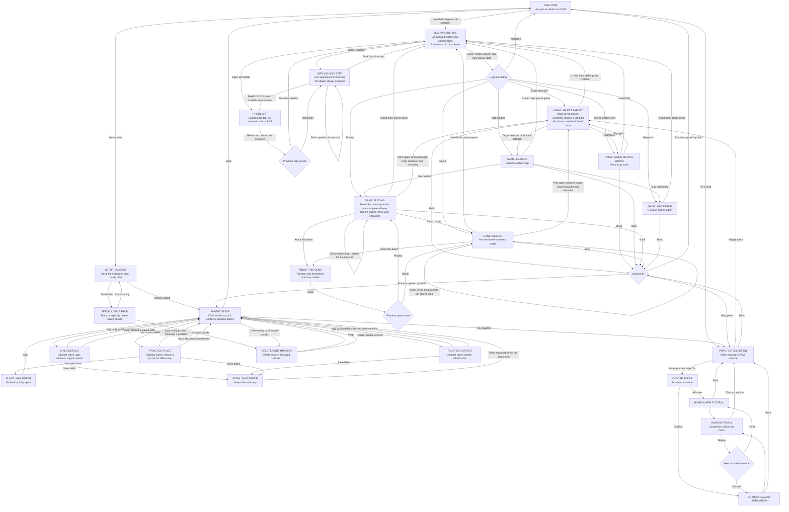
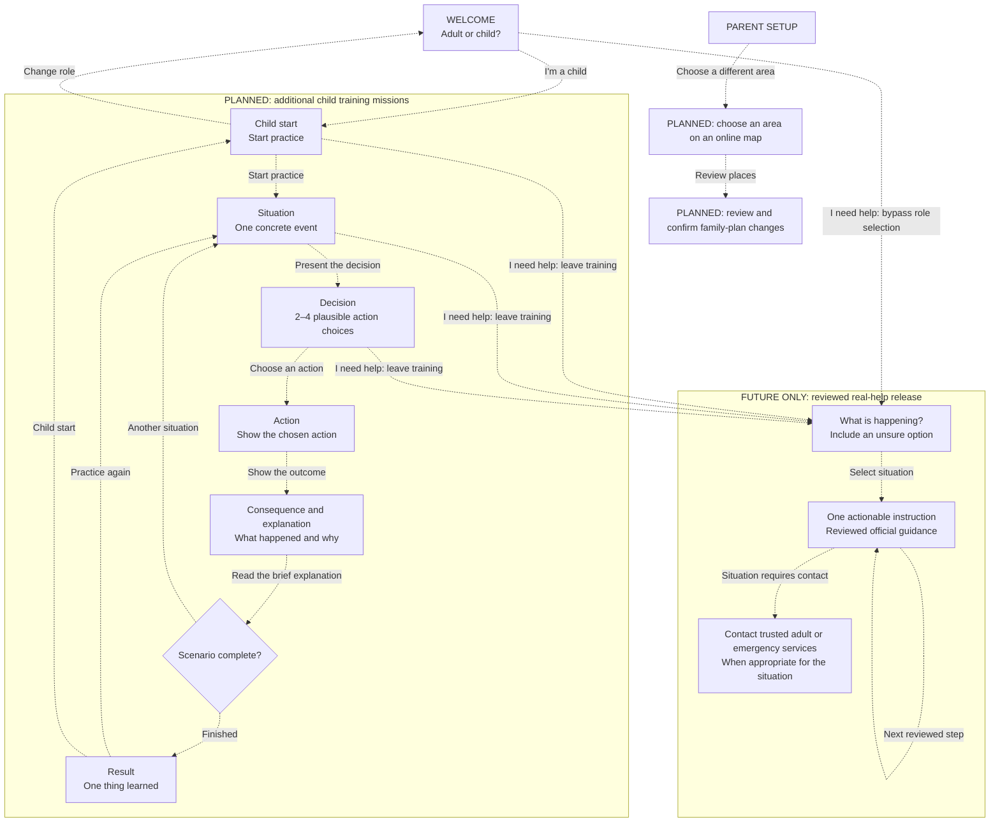

# Basebound screen and action reference

Updated: 2026-10-03. Android is the application; the Slidev screens are pitch prototypes.

## Implemented Android flow

Solid arrows describe working navigation and actions. Loading, result and error are screen states. Role selection changes the journey; it is not age verification or access control. Parent setup is freely accessible in this demo.

| Screen/state | One primary task | Secondary actions |
| --- | --- | --- |
| Welcome | Choose child or adult | Help prototype, without choosing a role |
| Practice selection | Choose alarm or map practice | Replay audio, back |
| Mission mode (7+) | Choose home or outside | Replay audio, choose practice |
| Mission scene | Make one visual decision or hear the situation | Replay audio, back |
| Mission feedback | See the consequence and explanation | Retry the same decision or advance; replay audio |
| Mission recall | See the six learned actions and completion sticker | Replay audio, replay mission, choose practice |
| Parent setup | Choose a setup task | Play together, confirmed Delete all, back |
| Child details | Edit optional child information | Save changes, back without saving |
| Trusted contact | Edit one of up to three contacts | Save changes, back without saving |
| Practice place | Name and position a practice pin | Tap or accessible centre/direction controls; save, back |
| Setup load error | Recover saved details | Retry, confirmed Delete all, back |
| Form save error | Retry saving without losing edits | Back without saving |
| Game target selection/error | Wait for saved places or retry | Help prototype, back |
| Game map loading | Wait for the offline map | Help prototype, back |
| Game playing | Move the character to the practice target | Help prototype, pan/zoom, show whole map, restart with a random target, demo information, back |
| Game result | Read the result and replay | Help prototype, pan/zoom, show whole map, demo information, back |
| Game load error | Retry saved details or reopen the map | Help prototype, back |
| Demo information | Read optional demo details | Close |
| Help prototype entry | Choose not responding, air raid, lost, or unsure | Open 112 dialler, no-signal information, close |
| Help step | Answer one question or read one instruction | Previous step, 112 dialler, trusted-contact dialler where offered |

Help content is bundled. Phone-app launch is real, but no call, connection, rescue, SMS delivery or verified route is inferred. Not-responding skips parent contact and offers 112 immediately. The air-raid flow does not offer routine parent voice calls. No-signal medical guidance is incomplete. See [EMERGENCY_HELP.md](EMERGENCY_HELP.md) for sources and the review required before real use. Adult setup configures contacts; help only reads its encrypted local record. Opening help during target selection defers creation of the game until help closes.

### Mission 01 — air-raid alarm practice

The home tutorial practices alarm recognition, moving away from windows, choosing an interior hallway, messaging a fictional trusted adult, staying after a noise, waiting through silence, and following an explicit all-clear. The premise is a fallback when the agreed shelter cannot be reached. An interior area and two walls offer some protection; the game does not certify a home as safe.

The MVP targets children aged 7+ with two to four choices and optional fictional outdoor practice: compare nearby shelter against distant destinations and exposed places. There is no younger-child branch or age-selection screen; saved age does not change this mission. An outdoor mistake leads to getting down (drag or tap), protecting the head, and moving to shelter. Home mistakes explain the consequence and retry without punishment. Both modes finish with a visual recall and completion sticker, with no score or timer.

Instructions, feedback, and replay use an installed offline English Android speech voice. If unavailable, the app shows an adult-help message; text remains as a fallback. Short warning and all-clear playback excerpts are teaching samples, not complete alarm signals. Contacts, messages, replies, shelter selection and movement are fictional; this mission neither calls nor sends messages nor uses saved personal contacts or map pins. See [mission-01-air-raid-alarm.md](mission-01-air-raid-alarm.md) for the scenario and source notes.

### Visual design system

The implemented screens share rounded Nunito typography, navy text, blue actions and white panels. Training uses warm or sky-tinted backdrops, a decorative green guide and bundled fictional room/hallway illustrations. Parent setup uses calmer form panels. Help retains a distinct flat cool theme and visible prototype notice. The visual redesign preserves all screen actions and return paths described above; see [UI_IMPLEMENTATION_PLAN.md](UI_IMPLEMENTATION_PLAN.md) for shared components and parallel ownership.

### Child map interaction

The parent pin editor shows accurate bundled OSM geometry; the child view is deliberately schematic. The square overview covers the same geographic extent as the offline source, but minor streets/buildings/POIs are omitted. Decorative trees and illustrated buildings are not exact real-world positions or outlines. Dragging or pinching explores without selecting a movement destination; only a resolved tap moves the character. Zoom buttons and Show whole map are secondary controls, disabled while loading or after a load error. Instructions and attribution stay outside scrolling areas. Only secondary controls can scroll; the map has its own gesture area. Short or large-text layouts use a shorter instruction, and landscape places the map beside instructions and controls. Water, energy and warmth cards remain removed. There is one restart control in each loaded game state. Restart/replay reloads the saved places, selects a fresh random target, and resets character and overview; repeats are possible.

### Data and demo boundaries

- One child; optional full name, age, address and support notes. No photo feature.
- Up to three trusted contacts; name, phone and relationship are optional. Saving a number does not make calls or verify it.
- Parent-selected places are named geographic pins inside the bundled TAURON Arena area. They are not verified safe destinations, walking routes, or emergency instructions.
- Each game launch and replay chooses a random valid saved place. Repeats are possible. No places means the original fictional base.
- The family plan persists in `flutter_secure_storage` using Android encryption. Android cloud backup and device-transfer rules exclude app data. No sync, migration or restore is promised.
- Encryption is not a parent gate: anyone using this unlocked app can view the records. Recommend fictional personal details for demonstrations. **Delete all saved details** removes this feature's child/contact/place record after confirmation; it does not silently reset failed reads.
- Keep map attribution visible. Preserve the distinction between real geography and simulated movement. Mission 01 implements fictional alarm decision training; validated real emergency assistance remains unimplemented. The separate help prototype is unreviewed.

## Proposed future product flow — not implemented

Dashed arrows describe future work. Keep adult configuration separate from child training. Online area selection, multi-device sharing and protected parent access are not available in this demo.

The future help entry must be reachable without completing onboarding. It must use different styling from training, omit scores and entertainment, and follow authoritative situation-specific guidance. This diagram defines navigation, not emergency procedures. Android now has an explicitly unreviewed help prototype, not released real assistance. The pitch still includes a simulated preview that does not assess danger or make calls.

Full reviewed emergency procedures, background messaging, walking mode, real navigation and validated real assistance remain future work. The implemented prototype is not a promotion of the future reviewed-help graph.

## Keeping this reference useful

Update the implemented graph when a screen, action or return path changes. Promote future nodes only when their behavior works. Concurrent map/help branches must reconcile their implemented flows at integration. Use [UX.md](UX.md) for product principles and [UX_REVIEW.md](UX_REVIEW.md) for the earlier simplification review.
