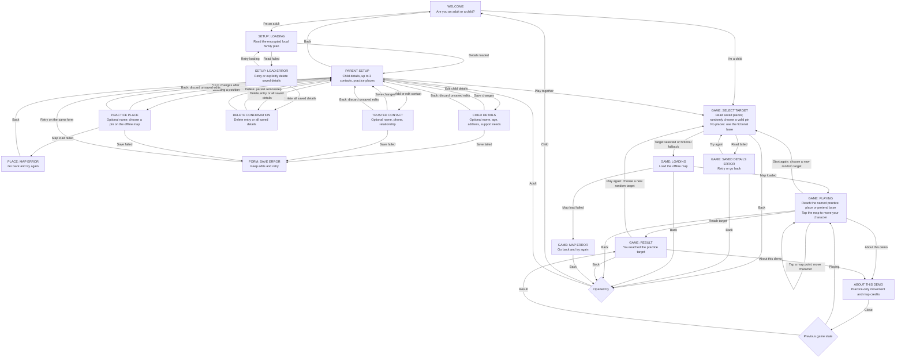
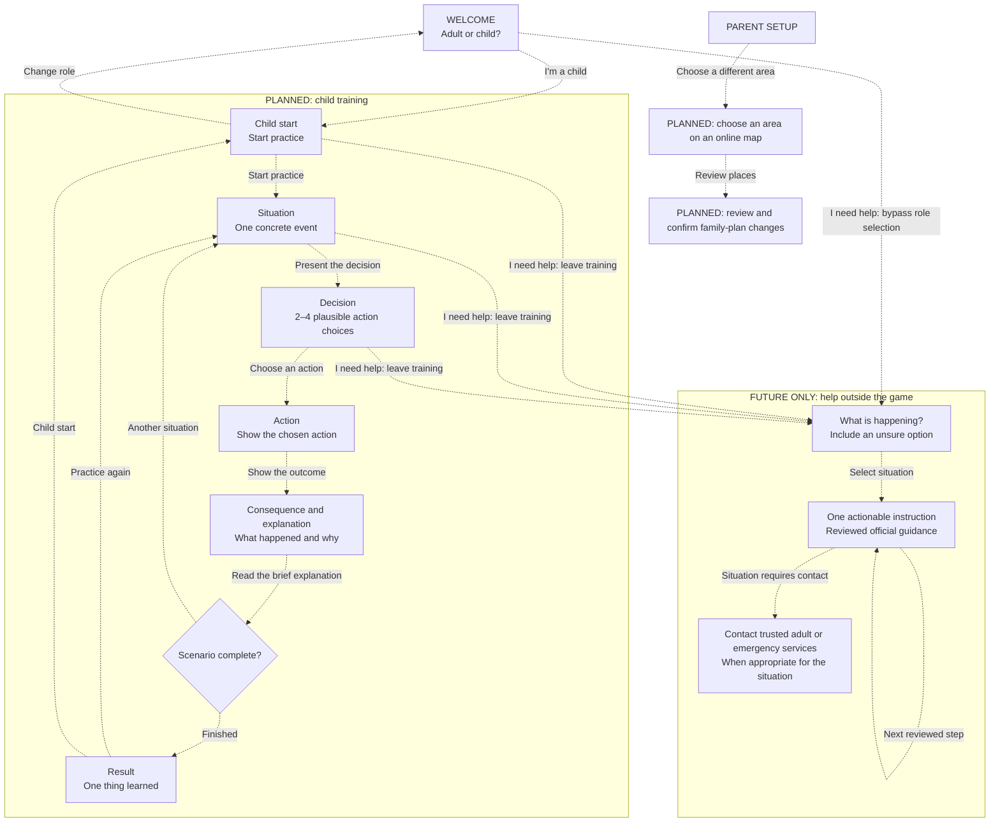

# Basebound screen and action reference

Updated: 2026-10-03. Android is the application; the Slidev screens are pitch prototypes.

## Implemented Android flow

Solid arrows describe working navigation and actions. Loading, result and error are screen states. Role selection changes the journey; it is not age verification or access control. Parent setup is freely accessible in this demo.

| Screen/state | One primary task | Secondary actions |
| --- | --- | --- |
| Welcome | Choose child or adult | None |
| Parent setup | Choose a setup task | Play together, confirmed Delete all, back |
| Child details | Edit optional child information | Save changes, back without saving |
| Trusted contact | Edit one of up to three contacts | Save changes, back without saving |
| Practice place | Name and position a practice pin | Tap or accessible centre/direction controls; save, back |
| Setup load error | Recover saved details | Retry, confirmed Delete all, back |
| Form save error | Retry saving without losing edits | Back without saving |
| Game target selection | Wait for saved places | Back |
| Game playing | Move the character to the practice target | Restart with a random target, demo information, back |
| Game result | Read the result and replay | Demo information, back |
| Game load error | Retry saved details or reopen the map | Back |
| Demo information | Read optional demo details | Close |

### Data and demo boundaries

- One child; optional full name, age, address and support notes. No photo feature.
- Up to three trusted contacts; name, phone and relationship are optional. Saving a number does not make calls or verify it.
- Parent-selected places are named geographic pins inside the bundled TAURON Arena area. They are not verified safe destinations, walking routes, or emergency instructions.
- Each game launch and replay chooses a random valid saved place. Repeats are possible. No places means the original fictional base.
- The family plan persists in `flutter_secure_storage` using Android encryption. Android cloud backup and device-transfer rules exclude app data. No sync, migration or restore is promised.
- Encryption is not a parent gate: anyone using this unlocked app can view the records. Recommend fictional personal details for demonstrations. **Delete all saved details** removes this feature's child/contact/place record after confirmation; it does not silently reset failed reads.
- Keep map attribution visible. Preserve the distinction between real geography and simulated movement. Emergency decision scenarios and real emergency assistance are not part of this parent-setup slice.

## Proposed future product flow — not implemented

Dashed arrows describe future work. Keep adult configuration separate from child training. Online area selection, multi-device sharing and protected parent access are not available in this demo.

The future help entry must be reachable without completing onboarding. It must use different styling from training, omit scores and entertainment, and follow authoritative situation-specific guidance. This diagram defines navigation, not emergency procedures. Help is absent from this Android branch; the pitch includes a simulated preview that does not assess danger or make calls.

## Keeping this reference useful

Update the implemented graph when a screen, action or return path changes. Promote future nodes only when their behavior works. Concurrent map/help branches must reconcile their implemented flows at integration. Use [UX.md](UX.md) for product principles and [UX_REVIEW.md](UX_REVIEW.md) for the earlier simplification review.
