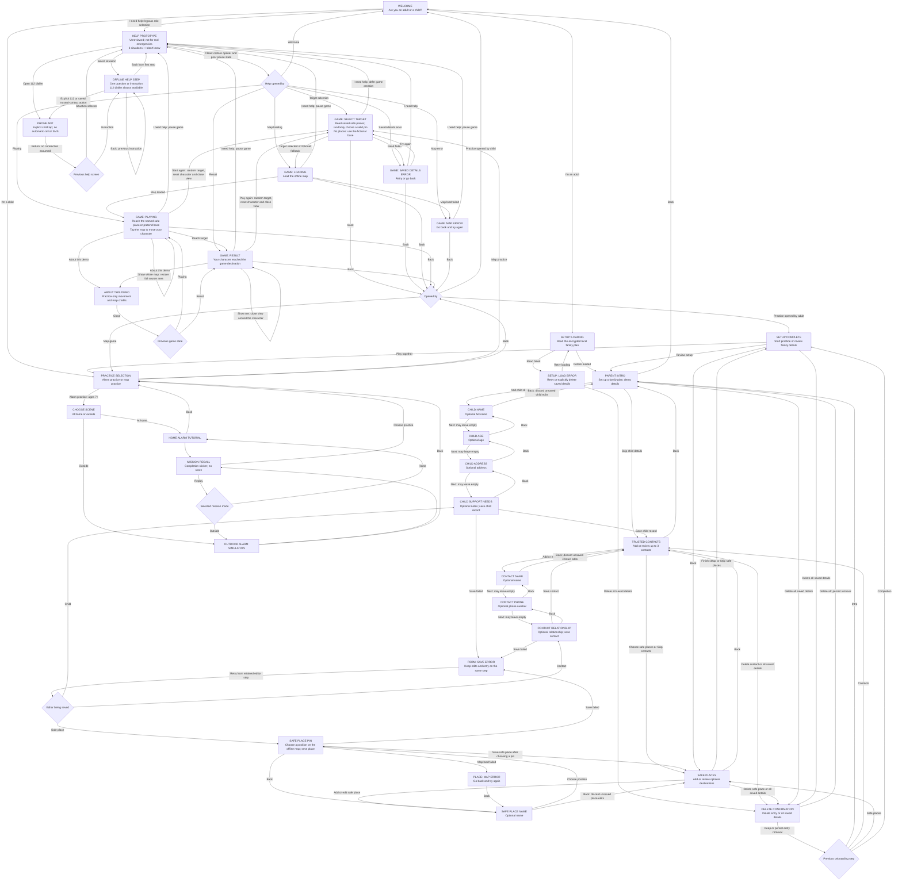
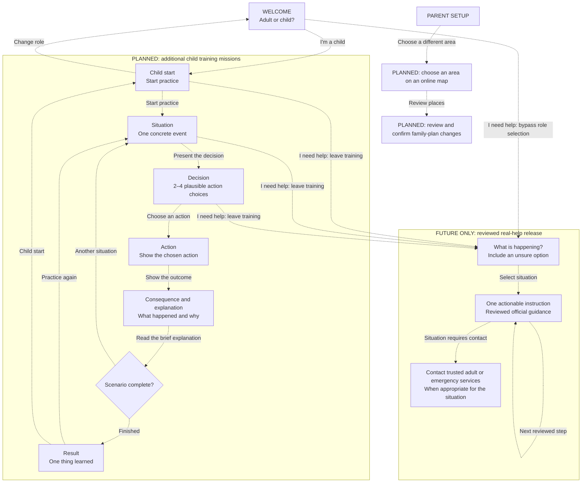

# Safe Path screen and action reference

Updated: 2026-10-03. Android is the application; the Slidev screens are pitch prototypes.

## Implemented Android flow

Solid arrows describe working navigation and actions. Loading, result and error are screen states. Role selection changes the journey; it is not age verification or access control. Parent onboarding is freely accessible in this demo. It asks for one action or piece of information per screen.

| Screen/state | One primary task | Secondary actions |
| --- | --- | --- |
| Welcome | Choose child or adult | Help prototype, without choosing a role |
| Practice selection | Choose alarm or map practice | Replay audio, back |
| Mission mode (7+) | Choose home or outside | Replay audio, choose practice |
| Mission scene | Make one visual decision or hear the situation | Replay audio, back |
| Mission feedback | See the consequence and explanation | Retry the same decision or advance; replay audio |
| Mission recall | See the six learned actions and completion sticker | Replay audio, replay mission, choose practice |
| Parent intro | Add child details | Skip child details, demo/privacy details, confirmed Delete all in Setup options, back |
| Child name, age, address, support needs | Enter one optional detail per screen | Next with value or empty field, previous step; final step saves child record |
| Trusted contacts | Add or review up to three contacts | Edit or confirmed delete; Choose safe places or Skip contacts; Setup options, back to intro |
| Contact name, phone, relationship | Enter one optional detail per screen | Next with value or empty field, previous step; final step saves contact |
| Safe places | Add or review optional safe places | Edit or confirmed delete; Finish setup or Skip safe places; Setup options, back to contacts |
| Safe place name | Name one safe place | Choose position, back without saving |
| Safe place pin | Choose one geographic position | Tap or accessible centre/direction controls; save, previous step |
| Setup complete | Play together | Review setup returns to intro; Setup options, back to safe places |
| Setup load error | Recover saved details | Retry, confirmed Delete all in Setup options, back |
| Form save error | Retry saving without losing edits | Back without saving |
| Game target selection/error | Wait for saved safe places or retry | Help prototype, back |
| Game map loading | Wait for the offline map | Help prototype, back |
| Game playing | Move the character to the selected safe place or pretend base; edge arrow points towards an offscreen target | Help prototype, pan/zoom, Show me, Show whole map, restart with a random target, demo information, back |
| Game result | Read the result and replay | Help prototype, pan/zoom, Show me, Show whole map, demo information, back |
| Game load error | Retry saved details or reopen the map | Help prototype, back |
| Demo information | Read optional demo details | Close |
| Help prototype entry | Choose not responding, air raid, lost, or unsure | Open 112 dialler, no-signal information, close |
| Help step | Answer one question or read one instruction | Previous step, 112 dialler, trusted-contact dialler where offered |

Each parent stage offers **Setup options → Delete all saved details**, with confirmation. Completed child, contact and safe-place editors save their records before returning; completing onboarding launches practice without an additional bulk save. **Review setup** returns to the intro and preserves saved records.

Help content is bundled. Phone-app launch is real, but no call, connection, rescue, SMS delivery or verified route is inferred. Not-responding skips parent contact and offers 112 immediately. The air-raid flow does not offer routine parent voice calls. No-signal medical guidance is incomplete. See [EMERGENCY_HELP.md](EMERGENCY_HELP.md) for sources and the review required before real use. Adult setup configures contacts; help only reads its encrypted local record. Opening help during target selection defers creation of the game until help closes.

### Mission 01 — air-raid alarm practice

The home tutorial practices alarm recognition, moving away from windows, choosing an interior hallway, messaging a fictional trusted adult, staying after a noise, waiting through silence, and following an explicit all-clear. The premise is a fallback when the agreed shelter cannot be reached. An interior area and two walls offer some protection; the game does not certify a home as safe.

The MVP targets children aged 7+ with two to four choices and optional fictional outdoor practice: compare nearby shelter against distant destinations and exposed places. There is no younger-child branch or age-selection screen; saved age does not change this mission. An outdoor mistake leads to getting down (drag or tap), protecting the head, and moving to shelter. Home mistakes explain the consequence and retry without punishment. Both modes finish with a visual recall and completion sticker, with no score or timer.

Instructions, feedback, and replay use an installed offline English Android speech voice. If unavailable, the app shows an adult-help message; text remains as a fallback. Short warning and all-clear playback excerpts are teaching samples, not complete alarm signals. Contacts, messages, replies, shelter selection and movement are fictional; this mission neither calls nor sends messages nor uses saved personal contacts or map pins. See [mission-01-air-raid-alarm.md](mission-01-air-raid-alarm.md) for the scenario and source notes.

### Visual design system

The implemented screens share rounded Nunito typography, navy text, blue actions and white panels. The current visual refinement adds a bespoke colourful vector icon family and six decorative dinosaur poses: wave, point, think, listen, celebrate and calm. Custom icons cover navigation, narration/replay, map controls, forms, mission choices and help; mission Canvas drawings and default back/close controls also use the family instead of Material font glyphs. Labels, tooltips, focus and disabled state remain on the native controls.

The compositions differ by task. Welcome has a grounded waving hero and role cards. Practice uses a pointing guide beside its heading and separate activity cards. Loading uses listen; recoverable errors use calm. The map uses a compact pointing instruction guide and a celebrating arrival state, with controls and credit outside its gesture area. Adult onboarding keeps compact illustrations and calm form panels, with one detail per screen and a visible step indicator. Help retains a distinct flat cool theme, restrained icons, no training mascot and the visible prototype notice.

Mission presentation is being refined around portrait 2:3 environment backgrounds, a separate scene-character pose sheet and native per-step choices anchored to the pictured objects. The dinosaur remains an editable vector guide. Backgrounds supply no interactive labels; the current step supplies character placement, target rectangles and its existing two to four actions. Mission screens reserve the bottom edge for the next/retry action and fit uncropped illustrations into the remaining height. Short, narrow and large-text layouts use compact accessible choice cards; unusually large text scrolls within the instruction or choice region while the primary action stays visible. Completion keeps replay and exit actions visible. The latest combined asset, layout and interaction checks are pending integrator verification; passing checks for the earlier visual baseline are recorded separately in [UI_IMPLEMENTATION_PLAN.md](UI_IMPLEMENTATION_PLAN.md).

This visual work preserves every screen action and return path described above. Neither the implemented graph nor the future graph changes, and no new mission content or real emergency assistance is introduced.

### Child map interaction

The parent pin editor and child view share the bundled OSM geography. The child view keeps actual building footprints, local streets, paths, tram lines, green areas and water, with soft colours and illustrated landmarks. Close zoom reveals service roads, paths, small footprints and play areas; tiny details and overlapping labels are omitted. Decorative trees and landmark artwork are illustrations. This incomplete map remains practice only.

The initial view is 4× zoom, covering roughly 500 × 500 metres around the character. It follows character movement within the source bounds. An edge arrow points towards an offscreen target and disappears when the target is visible or the game is complete; it shows direction, not a walking route. Dragging or pinching explores without selecting a movement destination and pauses following. Only a resolved tap moves the character and resumes following. Pinch/zoom controls allow 1–8×. **Show me** restores the 4× character view, and **Show whole map** shows the full source area without resetting progress. These controls are disabled while loading or after a load error. Instructions and attribution stay outside scrolling areas. Only secondary controls can scroll; the map has its own gesture area. Short or large-text layouts use a shorter instruction and a compact toolbar with 48-pixel touch targets, tooltips and accessibility labels. Landscape places the map beside instructions and controls. Water, energy and warmth cards remain removed. There is one restart control in each loaded game state. Restart/replay reloads the saved safe places, selects a fresh random target, and resets the character and close view; repeats are possible.

Map update checks on 2026-10-03: Flutter analysis reported no issues, all 14 existing tests passed, and the Android debug APK built. A disposable loaded Flutter rendering check verified the 4× start/nearby/reset view, 1× overview, character following, pan/pinch without movement, and the arrow appearing only for an offscreen unfinished target. Phone layouts passed at 390 × 844 and 320 × 700 with 200% text; the latter retained a 246-pixel map and all four map controls. No Android device walkthrough was performed.

### Data and demo boundaries

- One child; optional full name, age, address and support notes, entered one detail per screen. The child record is saved after the support-needs step. No photo feature.
- Up to three trusted contacts; optional name, phone and relationship, entered one detail per screen. Each completed contact and safe-place editor saves its record immediately. Back from the first editor step discards only unsaved edits. Saving a number does not make calls or verify it.
- Safe places are parent-selected destinations, stored as named geographic pins inside the bundled TAURON Arena area. Their safety and opening hours are not checked. The current demo uses them only for simulated character movement; it provides no walking route or emergency instructions.
- Each game launch and replay chooses a random valid saved safe place. Repeats are possible. No safe places means the original fictional base.
- The family plan persists in `flutter_secure_storage` using Android encryption. Android cloud backup and device-transfer rules exclude app data. No sync, migration or restore is promised.
- Encryption is not a parent gate: anyone using this unlocked app can view the records. Recommend fictional personal details for demonstrations. **Delete all saved details** removes this feature's child/contact/place record after confirmation; it does not silently reset failed reads.
- Keep map attribution visible. Preserve the distinction between real geography and simulated movement. Mission 01 implements fictional alarm decision training; validated real emergency assistance remains unimplemented. The separate help prototype is unreviewed.

## Proposed future product flow — not implemented

Dashed arrows describe future work. Keep adult configuration separate from child training. Online area selection, multi-device sharing and protected parent access are not available in this demo.

The future help entry must be reachable without completing onboarding. It must use different styling from training, omit scores and entertainment, and follow authoritative situation-specific guidance. This diagram defines navigation, not emergency procedures. Android now has an explicitly unreviewed help prototype, not released real assistance. The pitch still includes a simulated preview that does not assess danger or make calls.

Full reviewed emergency procedures, background messaging, walking mode, real navigation and validated real assistance remain future work. The implemented prototype is not a promotion of the future reviewed-help graph.

## Keeping this reference useful

Update the implemented graph when a screen, action or return path changes. Promote future nodes only when their behavior works. Concurrent map/help branches must reconcile their implemented flows at integration. Use [UX.md](UX.md) for product principles and [UX_REVIEW.md](UX_REVIEW.md) for the earlier simplification review.
