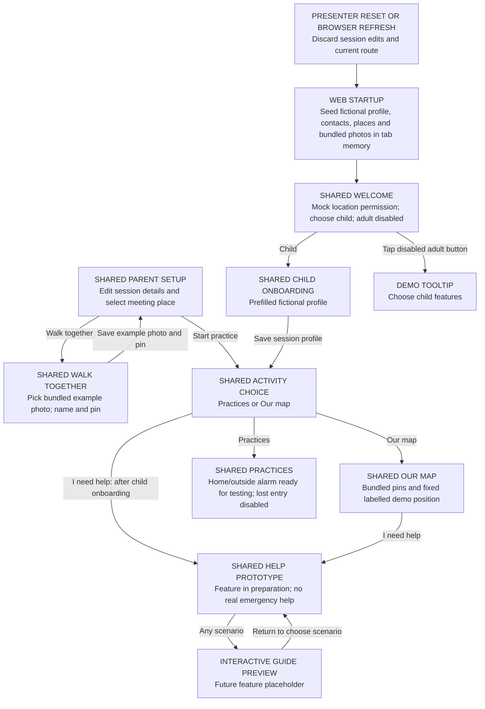
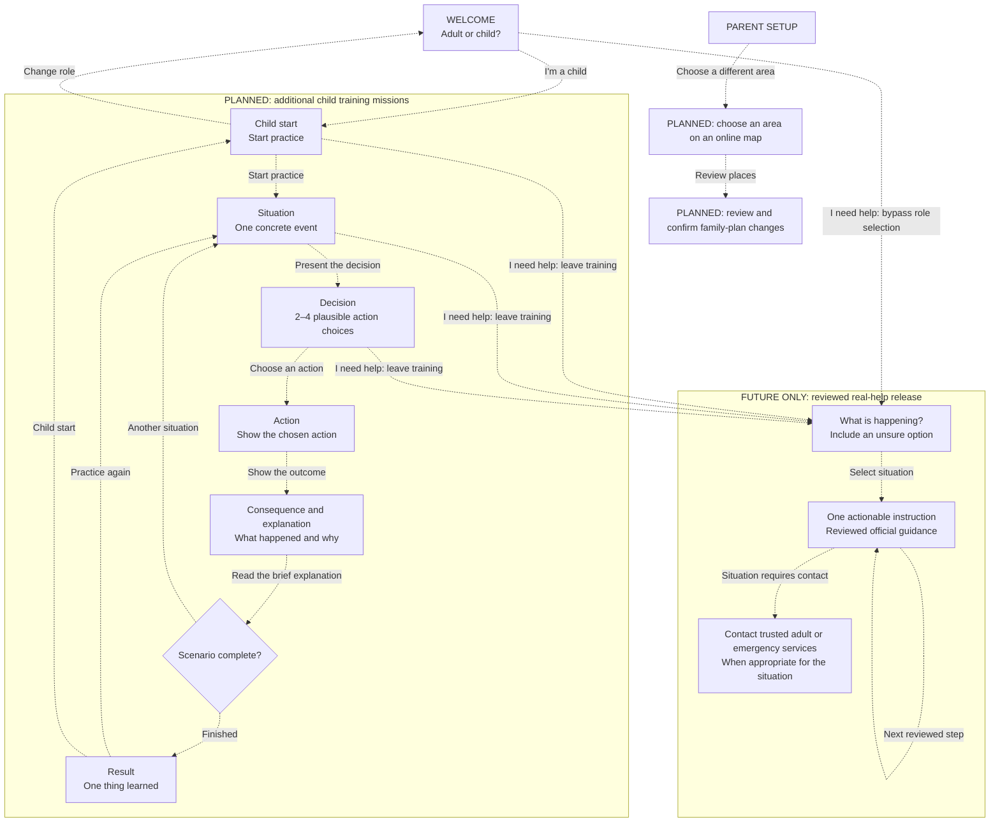

# Tuptu screen and action reference

The implemented Android app and browser demo use Polish throughout, including accessibility labels and narration. Key labels: “Jestem dzieckiem”, “Jestem osobą dorosłą”, “Ustawienia rodziny”, “Ćwiczenia”, “Nasza mapa”, “Wspólny spacer” and “Potrzebuję pomocy · prototyp”. Android narration requires an installed Polish offline voice. The English labels below remain descriptive references to the same screens and actions.
Updated: 2026-10-04. Android is the application; Flutter web is a shared-code demo
with mocked device features. The Slidev screens are pitch prototypes.

## Implemented Android flow

Solid arrows describe working navigation and actions. Loading, result and error are screen states. Role selection changes the journey; it is not age verification or access control. The adult welcome button is disabled for the demo. Tapping it shows a tooltip directing users to child features. Adult setup functions remain implemented; their retained flows are documented below. Parent onboarding asks for one action or piece of information per screen.

```mermaid
flowchart TD
    BOOT["FIRST LAUNCH<br/>Fill fictional child, contacts, places and linked photos; preserve saved records"]
    BE["STARTUP ERROR<br/>Retry; saved records remain intact"]
    W["WELCOME<br/>Ask foreground location once; choose child; adult disabled"]
    BOOT -->|Ready| W
    BOOT -->|Initialization failed| BE
    BE -->|Retry| BOOT
    BE -->|I need help| H
    A["PARENT INTRO<br/>Set up a family plan; demo details"]
    AL["SETUP: LOADING<br/>Read the encrypted local family plan"]
    AE["SETUP: LOAD ERROR<br/>Retry or explicitly delete saved details"]
    CN["CHILD NAME<br/>Optional full name"]
    CA["CHILD AGE<br/>Optional age"]
    CD["CHILD ADDRESS<br/>Optional address"]
    CS["CHILD SUPPORT NEEDS<br/>Optional notes; save child record"]
    CT["TRUSTED CONTACTS<br/>Add or review up to 3 contacts"]
    T["CONTACT NAME<br/>Optional name"]
    TP["CONTACT PHONE<br/>Optional phone number"]
    TR["CONTACT RELATIONSHIP<br/>Optional relationship; save contact"]
    SP["SAFE PLACES<br/>Add or review optional destinations"]
    M["SAFE PLACE NAME + ICON<br/>Optional name; choose emoji"]
    MP["SAFE PLACE PIN<br/>Choose a position on the offline map; save place"]
    ME["PLACE: MAP ERROR<br/>Go back and try again"]
    DONE["SETUP COMPLETE<br/>Start practice or review family details"]
    SE["FORM: SAVE ERROR<br/>Keep edits and retry on the same step"]
    DEL["DELETE CONFIRMATION<br/>Delete entry or all saved details"]
    F["OUR MAP: LOADING<br/>Read saved photo landmarks and named parent places"]
    FE["OUR MAP: LOAD ERROR<br/>Retry without resetting saved records"]
    L["OUR MAP: LOADING<br/>Load the offline map"]
    G["OUR MAP<br/>Photo landmarks, destination icons/photos and GPS walking guidance"]
    R["NEAR PLACE<br/>Accurate GPS is within 20 m; child confirms recognition"]
    E["OUR MAP: MAP ERROR<br/>Go back and try again"]
    I["ABOUT OUR MAP<br/>GPS, offline route limits and map credits"]
    H["HELP PROTOTYPE: WHAT IS HAPPENING?<br/>Not responding, air raid, lost, unsure"]
    GUIDE["PLANNED INTERACTIVE GUIDE<br/>Placeholder only; no emergency instructions"]

    LP["PARENT: WALK TOGETHER<br/>Independent photo landmarks on the offline map"]
    PHOTO["ANDROID CAMERA OR GALLERY<br/>Choose one photo; cancellation saves nothing"]
    LN["LANDMARK NAME<br/>Name one photographed place"]
    LPOINT["LANDMARK PIN<br/>Tap the map or explicitly use current GPS; confirm a demo-area pin"]
    LERR["LANDMARK LOAD ERROR<br/>Retry without resetting saved records"]
    A -->|Walk together, without completing setup| LP
    DONE -->|Walk together| LP
    LP -->|Load demo landmarks: add missing fictional points| LP
    LP -->|Take a photo: choose camera or gallery| PHOTO
    PHOTO -->|Photo chosen| LN
    PHOTO -->|Cancel| LP
    LP -->|Edit a saved landmark| LN
    LN -->|Choose map position| LPOINT
    LPOINT -->|Back: retain name and chosen pin| LN
    LN -->|Back without saving| LP
    LPOINT -->|Save name, photo copy and pin| LP
    LPOINT -->|Save failed: retain edits and retry| LPOINT
    LPOINT -->|GPS denied, unavailable or outside map: choose manually| LPOINT
    LP -->|Photo pin: view detail; edit or confirmed delete| LP
    LP -->|Confirmed Delete all landmarks| LP
    LP -->|Back: return to parent opener| LRETURN{"Opened by"}
    LRETURN -->|Introduction| A
    LRETURN -->|Completion| DONE
    LP -->|Load failed| LERR
    LERR -->|Retry| LP

    PS -->|I need help: after child onboarding; pause narration| H
    F -->|I need help: defer map creation| H
    FE -->|I need help| H
    L -->|I need help: pause map GPS and narration| H
    G -->|I need help: pause map GPS and narration| H
    R -->|I need help: pause map GPS and narration| H
    E -->|I need help: pause map GPS and narration| H
    H -->|Any of the four scenarios| GUIDE
    GUIDE -->|Return to choose scenario or Back| H
    H -->|Close: restore opener| HP{"Help opened by"}
    HP -->|Startup error| BE
    HP -->|Activity selection: resume narration| PS
    HP -->|Saved-place loading| F
    HP -->|Saved-details error| FE
    HP -->|Map loading| L
    HP -->|Map: obtain fresh GPS| G
    HP -->|Near place: obtain fresh GPS| R
    HP -->|Map error| E
    W -->|Tap disabled adult button| AD["DEMO TOOLTIP<br/>Choose child features"]
    AL -->|Details loaded| A
    AL -->|Read failed| AE
    AE -->|Retry loading| AL
    AE -->|Delete all saved details| DEL
    W -->|I'm a child| OA["CHILD ONBOARDING: AGE<br/>Enter age 1–99; starts empty on each visit"]
    OA -->|Add my name| ON["CHILD ONBOARDING: NAME<br/>Name or nickname"]
    OG -->|Start practice: save encrypted local details| PS["ACTIVITY SELECTION<br/>Practices or Our map"]
    OG -->|Save failed: retain edits and retry| OG
    ON -->|Choose my character| OG["CHILD ONBOARDING: GENDER<br/>Girl or boy with character previews"]
    ON -->|Back| OA
    OA -->|Back| W
    OG -->|Back| ON
    PS -->|Our map| F
    PS -->|Practices| SC["PRACTICE SCENARIOS<br/>Alarm ready for testing; lost practice disabled"]
    SC -->|Back| PS
    SC -->|Alarm practice: ages 7+| MODE["CHOOSE SCENE<br/>At home or outside"]
    MODE -->|Back or Choose a scenario| SC
    MODE -->|At home| HOME["HOME ALARM TUTORIAL"]
    MODE -->|Outside| OUT["OUTDOOR ALARM SIMULATION"]
    HOME --> MC["FICTIONAL FAMILY<br/>Choose Mom, Dad or Grandparent"]
    MC --> MM["TRY ONE CALL<br/>Pretend call to the chosen adult"]
    MM -->|Try one call| MPL["LOAD PHONE PRACTICE<br/>Read saved trusted contacts locally"]
    MPL -->|Usable saved number| MPK["PRETEND PHONE KEYPAD<br/>Enter a saved trusted adult's number"]
    MPL -->|No usable number| MPN["NO SAVED NUMBER<br/>Explain adult setup"]
    MPL -->|Read failed| MPE["PHONE PRACTICE READ ERROR<br/>Preserve saved details"]
    MPE -->|Try loading again| MPL
    MPK -->|Digits, backspace, Clear or Need a hint?| MPK
    MPK -->|Incorrect number: show one saved number above keypad and calm retry| MPK
    MPK -->|Matching number; Call on pretend phone| MBUSY["BUSY LINE<br/>Busy signal, then explain that the call failed"]
    MPN -->|Continue without a number| MBUSY
    MPE -->|Continue without a number| MBUSY
    MBUSY -->|After cue and feedback| MSMS["CALL FAILED<br/>Send an SMS"]
    MSMS -->|Send an SMS| MPR["PRETEND CONVERSATION<br/>Outgoing message and adult reply on one screen; nothing sent"]
    MPR -->|Stay here| MW["WAITING PRACTICE<br/>Noise, silence and explicit all-clear"]
    MW --> MR["MISSION RECALL<br/>Three illustrated reminders and Dino praise; no score"]
    OUT -->|Choose where to go| OS_DEST["OUTDOOR DESTINATION<br/>Home, school, nearby shelter or other places"]
    OS_DEST -->|Other places; automatic feedback| OS_OTHER["NEARBY PLACES<br/>Park, bus stop or nearby shelter"]
    OS_DEST -->|Home or school| OS_FEEDBACK["DESTINATION FEEDBACK<br/>Explain why the child is still outside"]
    OS_OTHER -->|Park or bus stop| OS_FEEDBACK
    OS_FEEDBACK -->|After feedback| OS_NOISE["STILL OUTSIDE<br/>Same chosen destination; restrained sound cue"]
    OS_NOISE -->|Choose what to do| OS_DOWN["GET DOWN<br/>Drag down or tap one of two pictured actions"]
    OS_DOWN -->|Keep standing; calm feedback and retry| OS_DOWN
    OS_DOWN -->|Get down; automatic feedback| OS_HEAD["PROTECT YOUR HEAD<br/>Two pictured actions"]
    OS_HEAD -->|Keep hands down; calm feedback and retry| OS_HEAD
    OS_HEAD -->|Cover head; automatic feedback| OS_ADULT["AN ADULT HELPS YOU<br/>Stay down; adult leads to shelter when possible in this story"]
    OS_ADULT -->|Follow the adult| OS_SHELTER["INSIDE THE PRACTICE SHELTER<br/>Away from windows"]
    OS_DEST -->|Nearby shelter; automatic feedback| OS_SHELTER
    OS_OTHER -->|Nearby shelter; automatic feedback| OS_SHELTER
    OS_SHELTER -->|Tell a trusted adult| MC
    MR -->|Replay| RE{"Selected mission mode"}
    RE -->|Home| HOME
    RE -->|Outside| OUT
    HOME -->|Back| SC
    OUT -->|Back| SC
    MR -->|Back to practice choices| SC
    subgraph LOST["MISSION 02: INTERNAL FICTIONAL LOST PRACTICE, AGES 7+; PUBLIC ENTRY DISABLED"]
        LL["LOAD PRACTICE FAMILY<br/>Read current encrypted record; display-only snapshot"]
        LE["READ ERROR<br/>Retry or explicitly use pretend family; preserve record"]
        LV["CHOOSE LOST SCENE<br/>Nearby available; out of sight unfinished"]
        LS["STOP<br/>Stop instead of running or leaving"]
        LO["LOOK<br/>Remember the parent-selected photo and name"]
        LP["NEARBY POINT<br/>Recognize the exact saved photo"]
        LMAP["OUR MAP PRACTICE<br/>Find the same photo pin; saved Home is tappable<br/>Drag, pinch or use Places"]
        LARR["STORY ARRIVAL<br/>Fictional movement; no GPS arrival claim"]
        LMISSING["MEETING PLACE UNAVAILABLE<br/>Ask for parent setup; retry or explicitly use demo"]
        LN["POINT OUT OF SIGHT<br/>Stay nearby and ask for help"]
        LH["HELPER<br/>Ask staff at a visible public desk"]
        LU["STAY HERE<br/>Decline leaving with an unknown person"]
        LC["FAMILY CARDS<br/>Choose a pretend call"]
        LA["NO ANSWER<br/>Stay; try a different trusted person"]
        LR["PRETEND REPLY<br/>Family knows the story location"]
        LW["WAIT<br/>Stay with staff"]
        LJ["REUNION<br/>Parent arrives in the story"]
        LI["I'M SAFE<br/>Explicit tap; local training state only"]
        LD["PRETEND CONFIRMATION<br/>No message was sent"]
        LRC["LOST RECALL<br/>Seven actions; no score"]
        LF["LOST COMPLETE<br/>Replay or return to practice"]
        LL -->|Chosen photo, default saved photo or legacy demo picture| LV
        LL -->|No available photo, deleted chosen photo or unavailable pin| LMISSING
        LMISSING -->|Parent setup; reload on return| AL
        LMISSING -->|Retry| LL
        LL -->|Read failed| LE
        LE -->|Try again| LL
        LE -->|Use pretend family| LV
        LV -->|Choose nearby variant| LS
        LV -->|Tap disabled out-of-sight variant: unfinished tooltip| LV
        LS -->|Accepted choice; narrated feedback and automatic advance| LO
        LS -->|Mistake; mute target and choose again| LS
        LO -->|Nearby variant| LP
        LO -->|Out-of-sight variant| LN
        LP -->|Recognized saved photo| LMAP
        LP -->|Demo picture only| LARR
        LMAP -->|Wrong pin; feedback and choose another pin| LMAP
        LMAP -->|Correct pin; recognition only| LARR
        LMAP -->|I cannot find it| LN
        LARR --> LH
        LN --> LH
        LH --> LU
        LU --> LC
        LC --> LA
        LA --> LR
        LR --> LW
        LW --> LJ
        LJ --> LI
        LI -->|I'M SAFE; no communication| LD
        LD --> LRC
        LRC --> LF
        LF -->|Play again: retain variant and display snapshot| LS
    end
    SC -->|Tap disabled lost entry: choose alarm practice| SC
    LOST -->|Back or exit: stop narration| SC
    LF -->|Back to practice choices| SC
    PS -->|Back| B
    A -->|Add child details| CN
    A -->|Skip child details| CT
    CN -->|Next: may leave empty| CA
    CA -->|Next: may leave empty| CD
    CD -->|Next: may leave empty| CS
    CS -->|Save child record| CT
    CT -->|Add or edit contact| T
    T -->|Next: may leave empty| TP
    TP -->|Next: may leave empty| TR
    TR -->|Save contact| CT
    CT -->|Choose safe places or Skip contacts| SP
    SP -->|Add or edit safe place| M
    SP -->|Add or edit practice meeting point| PMI["MEETING PLACE PHOTO<br/>Select an existing photo landmark by ID"]
    PMI -->|Add or edit photos| LP
    LRETURN -->|Meeting-point editor; reload photos| PMI
    PMI -->|Explicit pretend picture; optional demo label| PMI
    PMI -->|Save practice meeting point| SP
    PMI -->|Back: discard unsaved selection| SP
    PMI -->|Save failed: retain selection| SE
    M -->|Choose position| MP
    MP -->|Save safe place after choosing a pin| SP
    SP -->|Finish setup or Skip safe places| DONE
    DONE -->|Play together| PS
    DONE -->|Review setup| A
    CA -->|Back| CN
    CD -->|Back| CA
    CS -->|Back| CD
    CN -->|Back: discard unsaved child edits| A
    TP -->|Back| T
    TR -->|Back| TP
    T -->|Back: discard unsaved contact edits| CT
    MP -->|Back| M
    M -->|Back: discard unsaved place edits| SP
    CT -->|Back| A
    SP -->|Back| CT
    DONE -->|Back| SP
    CS -->|Save failed| SE
    TR -->|Save failed| SE
    MP -->|Save failed| SE
    SE -->|Retry from retained editor step| RETRY{"Editor being saved"}
    RETRY -->|Child| CS
    RETRY -->|Contact| TR
    RETRY -->|Safe place| MP
    RETRY -->|Practice meeting point| PMI
    MP -->|Map load failed| ME
    ME -->|Back| M
    CT -->|Delete contact or all saved details| DEL
    SP -->|Delete safe place or all saved details| DEL
    A -->|Location in Setup options: explicit permission retry or Android settings| A
    A -->|Delete all saved details| DEL
    DONE -->|Delete all saved details| DEL
    DEL -->|Keep or persist entry removal| RETURN{"Previous onboarding step"}
    RETURN -->|Intro| A
    RETURN -->|Contacts| CT
    RETURN -->|Safe places| SP
    RETURN -->|Completion| DONE
    DEL -->|Delete all: persist removal| A
    A -->|Back| W
    F -->|Load map geography| L
    F -->|Read failed| FE
    FE -->|Try again| F
    L -->|Map loaded| G
    L -->|Map load failed| E
    E -->|Try again| F
    G -->|Tap photo pin, nearby landmark or place list: open details only| G
    G -->|Fresh precise GPS: show nearest photo landmark within 50 m| G
    G -->|Calculate or replan path| SEARCH["FINDING A PATH<br/>Dinosaur with spyglass; cancel available"]
    SEARCH -->|Path or no-path result ready| G
    SEARCH -->|Cancel calculation| G
    G -->|Automatic foreground GPS; no permission prompt| GPS["GPS STATE<br/>Waiting, live, approximate, denied, disabled, stale or outside map"]
    GPS -->|Fresh position: update dot and route progress| G
    GPS -->|No valid position: no invented dot or active directions| G
    G -->|Walk here together: selected real place and precise in-area GPS| NAV["WALKING GUIDANCE<br/>Offline path + upcoming turn, metres and photo destination"]
    NAV -->|GPS follows path: advance turn cues| NAV
    NAV -->|Accurate GPS more than 25 m off route: replan| NAV
    NAV -->|No connected route: explain; no straight-line substitute| G
    NAV -->|Old, approximate or outside GPS: pause guidance| G
    NAV -->|GPS within 20 m of original pin; accuracy at most 20 m| R
    R -->|I recognise this place: stop directions; show feedback| G
    NAV -->|Stop directions| G
    G -->|Drag to pan; pinch to zoom 1–8×; GPS never changes camera| G
    G -->|Places: open accessible place selection| G
    G -->|About our map| I
    R -->|About our map| I
    I -->|Close| G
    NAV -->|I need help: pause map GPS and narration| H
    HP -->|Walking guidance: obtain a fresh GPS fix| G
    F -->|Back| B{"Opened by"}
    FE -->|Back| B
    L -->|Back| B
    G -->|Back| B
    R -->|Back| B
    E -->|Back| B
    B -->|Our map| PS
    B -->|Practice opened by child| W
    B -->|Practice opened by adult| DONE
```

| Screen/state | One primary task | Secondary actions |
| --- | --- | --- |
| First-launch loading/error | Prepare three photo landmarks, fictional Home and a linked meeting place | No Help button while loading; Retry and Help prototype on failure; existing records preserved |
| Welcome | Foreground location permission once, then choose child or adult | Denial permits navigation; two role choices |
| Child onboarding | Enter age, name or nickname, then select girl or boy | Confirm the current field with “Zatwierdź wiek” / “Zatwierdź imię”; Back keeps edits; load/save errors allow retry; each visit starts empty |
| Activity selection | Choose Practices or Our map | Help prototype after child onboarding; replay audio, back |
| Practice scenarios | Choose alarm or lost practice | Replay audio, back to activities |
| Mission mode (7+) | Choose home or outside | Replay audio in header; header or system Back returns to scenarios |
| Mission scene | Tap a pictured scene object to choose an action, or hear the situation | Replay audio, mute/unmute sound effects, back |
| Outdoor interruption/recovery | Connect the chosen destination to still being outside; get down, cover head, then follow the adult in the story | Drag or equivalent tap; retry physical choices; nearby shelter skips this branch |
| Alarm phone practice | Enter a saved trusted adult's number using the pretend keypad | Backspace, Clear, single contact-number hint above the keypad, shown automatically after an incorrect number; match the number, then Send pretend message |
| Alarm phone practice unavailable | Explain missing saved numbers or a failed read | Continue without a number; failed reads also offer Try loading again; saved details remain intact |
| Alarm pretend conversation | See the outgoing message and adult reply together | Stay here continues to the loud-noise decision; Practice only. Nothing was sent. |
| Mission feedback | See the consequence and explanation | Choose another action after a mistake; accepted actions advance automatically; replay audio, mute/unmute sound effects |
| Mission recall/completion | Read three numbered reminders with short descriptions and Dino’s praise once, without a duplicate completion heading | Finish practice; replay audio, Play again, Back to practice choices |
| Lost entry | Unfinished scenario; disabled **Ćwicz z mapą** tile | Tap or hover for the tooltip directing the child to **Słyszysz alarm** |
| Internal lost practice loading/error | Load the current display-only family snapshot | Retry or explicitly use pretend family; back preserves saved details |
| Lost scene selection (7+) | Choose meeting point nearby; out-of-sight option disabled with unfinished tooltip | Replay audio, back; unavailable voice offers adult help and retry |
| Lost decision/feedback | Choose highlighted scene objects; recognize the chosen photo; find its pin on Our map | Rejected pictured choices stay muted; choose another action immediately; wrong map pins remain selectable and repeat their explanation; accepted choices advance after narration and at least three seconds; map drag/pinch, Places, I cannot find it, replay audio and exit remain available |
| Lost reunion/confirmation | Tap I'M SAFE after the fictional reunion | Explicit local confirmation; no message sent |
| Lost recall/completion | Dino praise and three numbered reminders, including meeting point only if visible nearby | Replay audio, Play again with the same snapshot/variant, Back to practice choices |
| Parent intro | Add child details | Walk together; Skip child details, demo/privacy details, confirmed Delete all and explicit location recovery in Setup options, back |
| Child name, age, address, support needs | Enter one optional detail per screen | Next with value or empty field, previous step; final step saves child record |
| Trusted contacts | Add or review up to three contacts | Edit or confirmed delete; Choose safe places or Skip contacts; Setup options, back to intro |
| Contact name, phone, relationship | Enter one optional detail per screen | Next with value or empty field, previous step; final step saves contact |
| Safe places | Add or review optional map places or a lost-practice landmark | Edit or confirmed delete; Finish setup or Skip safe places; Setup options, back to contacts |
| Practice meeting point | Choose an existing photo landmark by ID; its name and photo stay linked | Add/edit in Walk together; explicit pretend-picture alternative; save with retained edits on failure; back without saving |
| Safe place name | Name one safe place and choose an emoji icon | Choose position, back without saving |
| Safe place pin | Choose one geographic position | Tap the map to place or move the pin; save, previous step |
| Setup complete | Play together | Walk together; Review setup returns to intro; Setup options, back to safe places |
| Setup load error | Recover saved details | Retry, confirmed Delete all in Setup options, back |
| Form save error | Retry saving without losing edits | Back without saving |
| Our map loading/error | Load named places, photo metadata and offline map | Retry without resetting records; Help prototype, back |
| Our map | Select a familiar place or inspect the nearest landmark | Places selector, automatic foreground GPS, gesture pan/zoom, audio replay, info, Help prototype |
| Walking guidance | Follow the next mapped turn with an adult | Route distance, destination photo, stop directions, change destination |
| Near place | Confirm recognising the original photo place | Accurate GPS required; path endpoint alone does not confirm arrival |
| Map information | Read optional GPS and coverage details | Close |
| Parent landmark library | Add a photo of one familiar place | Camera/gallery choice, explicit Load demo landmarks, tap a pin for details, edit name/pin, confirmed delete or delete all, back to opener |
| Landmark name | Name the photographed place; photo only | Choose map position, back without saving |
| Landmark pin | Confirm one position inside the demo map | Tap the map to place or move the pin, optional foreground GPS, previous step; saving preserves edits on failure |
| Landmark load error | Retry reading saved landmarks | Back; no silent deletion or reset |
| Help prototype entry | Choose the situation | Not responding / Słyszysz syrenę / lost / unsure; close |
| Help guide preview | Read that a child-friendly interactive guide is planned | Wróć do wyboru scenariusza or Back restores the four help choices |

Child onboarding stores name, age and optional serialized gender in the existing encrypted family record, preserving address, support notes, contacts and practice places. Older records without gender still load. Character selection shows front-facing girl and boy illustrations side by side, each with its text-only selection button directly below. The selected girl or boy appears in mission poses; the map uses a blue GPS dot; adult Play together also uses the saved character. Age entry is personalization, not age verification. Returning to the child route starts the three steps with empty name and age fields and no selected character; back within the current visit keeps edits.

Each parent stage offers **Setup options → Delete all saved details**, with confirmation. Completed child, contact and safe-place editors save their records before returning; completing onboarding launches practice without an additional bulk save. **Review setup** returns to the intro and preserves saved records.

Help opens with four situation choices. Every choice opens the same **Interaktywny przewodnik** placeholder, explaining that a future guide will show children what to do step by step. **Wróć do wyboru scenariusza** and Back return to these four help choices. Closing the situation screen restores the opener. The visible notice labels the feature as in preparation and not for real emergencies.

The previous emergency instructions, helper branches, phone actions, contact loading, telephone-service monitoring and help-owned GPS are no longer connected to the UI. Help does not call, show pretend-call dialogs or send messages. Opening it still pauses the map GPS and narration; closing it restores them. See [the decision diagram](I_NEED_HELP_DECISION_DIAGRAM.md) and [EMERGENCY_HELP.md](EMERGENCY_HELP.md).

### Mission 01 — air-raid alarm practice

The home tutorial practices alarm recognition, moving away from windows, choosing an interior hallway, a pretend call followed by an SMS when there is no answer, staying after a noise, waiting through silence, and following an explicit all-clear. The premise is a fallback when the agreed shelter cannot be reached. An interior area and two walls offer some protection; the game does not certify a home as safe.

The home alarm bell appears at the window to show the sound coming from outside. Each fictional Mom, Dad or Grandparent portrait has its name beside it. After choosing an adult, **Try one call** practices a single pretend call. Choosing **Try one call** opens a pretend numeric keypad within the mission. The child practices a number from the encrypted local trusted-contact records, with digits, backspace and Clear. Any saved usable contact number matches after removing formatting such as `+`, spaces and separators; country-code digits remain required. **Need a hint?** reveals the first saved contact’s number above the keypad, with a bold blue number on a pale blue bordered panel. Only the screen title appears above the number; the instructions remain available through narration. An incorrect number shows this hint automatically. The browser demo’s Mom number is `555333444`, without a country code (Dad: `555333445`, Grandparent: `555333446`). A correct match replaces the introductory text with Dino celebrating while holding a phone directly above the entered number. A green success tile below the number shows a check symbol and “Numer zgadza się z zapisanym kontaktem.” The hint is hidden after a match. Success remains available to screen readers and narration. **Call on pretend phone** then becomes available. A quiet local busy signal plays, then narration explains that the line is busy and the call could not connect. After this feedback, **Send an SMS** becomes available. Effects can be muted; the written explanation remains. These are guided actions, each with one target. One conversation screen then shows the outgoing “I am away from windows.” and adult reply “Good. Stay there and wait for the all-clear.” together, labelled **Practice only. Nothing was sent.** **Stay here** advances directly to the loud-noise decision. If no usable number is saved, the screen explains adult setup and offers **Continue without a number**. A failed read offers **Try loading again** or **Continue without a number**, preserving saved records. Both fallback actions continue through the simulated busy call and SMS choice.

The MVP targets children aged 7+ with two to four choices and optional fictional outdoor practice: compare nearby shelter against distant destinations and exposed places. Child onboarding collects age, but there is no younger-child branch; saved age does not change this mission. An outdoor mistake first explains why the child remains outside, then a short “Still outside” scene names the chosen destination as a sound interrupts the journey. The next two decisions practice getting down (drag or tap) and covering the head. An explicit story scene keeps the child down while a trusted adult helps them reach shelter when possible; arriving at the shelter then leads to fictional contact selection. Choosing the nearby shelter skips this recovery branch. Home and physical-action mistakes show immediate dinosaur feedback, grey out the rejected target, and let the child choose again without moving. Accepted actions and outdoor destination consequences advance automatically after narration and a minimum three-second reading pause. Both modes finish with three numbered reminders, matching icons and short descriptions: find a protected place away from windows, call a trusted adult then send an SMS if there is no answer, and wait for the all-clear even when it is quiet. Dino celebrates with “You did a great job! You finished the practice.” The same recap appears before Finish practice and on completion, and narration reads the displayed text. There is no score or countdown.

Instructions, feedback, and replay use an installed offline Polish Android speech voice. If unavailable, the app shows an adult-help message; text remains as a fallback and sound cues can still play. Gentle selection, action, success and retry cues accompany feedback. A separate sound-effects control mutes cues while leaving narration available. Playback stops when the app backgrounds or the mission exits. Short warning and all-clear playback excerpts are teaching samples, not complete alarm signals; the outdoor interruption uses a restrained fictional noise. Family avatars, messages, replies, shelter selection and movement are fictional. Saved trusted contacts are read only for local phone-number practice; typed digits are not persisted. The mission makes no calls, sends no SMS, opens no external app and uses no network or saved map pins. Matching a saved number does not verify the contact, delivery or safety. See [mission-01-air-raid-alarm.md](mission-01-air-raid-alarm.md) for the scenario and source notes.

On **It is quiet now**, the child stays inside the hallway. After either choice, the door target is greyed out and disabled. Dino's visible and spoken feedback says to stay inside the home (or shelter in outdoor practice) and wait for the all-clear. Before selection, both targets retain their neutral styling.

### Mission 02 — lost practice

The lost entry, labelled **Ćwicz z mapą**, is disabled and dimmed in the scenario list. Tapping or hovering shows a tooltip directing the child to choose **Słyszysz alarm**; scenario narration gives the same direction. The internal 7+ launcher retains the nearby meeting-point variant for continued development and focused tests. The out-of-sight variant is unfinished and disabled in the selector; tapping it explains that the child should choose the nearby scenario. The existing scenario code covers both variants, which practice stopping, looking, asking at a nearby public desk, declining to leave with an unknown person, a pretend call with no answer, trying a different contact, waiting, reunion, an explicit I'M SAFE tap and a short recall. Lost and air raid reuse `PracticeContactPicker`: a pretend phone list with an avatar and a visible name for each contact. Lost practice uses its configured or explicitly fictional display contacts; its no-answer screen excludes the first contact and keeps the separate stay/leave decision. Contact selection does not call anyone. Lost and air raid share the same recap component before Finish practice and on completion: Dino’s “You did a great job!” and three numbered reminders with matching icons. Lost groups the practiced actions into stopping/looking (meeting place only if visible nearby), asking for help/contacting family/waiting, and confirming after reunion. The pretend-message notice remains visible; narration reads the same praise and reminders. Dino and the feedback message share a green tile after a correct choice, or a coral tile for retry feedback, matching other practice screens. Wrong choices keep the illustrated scene visible, mute the rejected object and allow another choice immediately. Accepted choices advance after narration and a minimum three-second reading pause. Story actions and the post-reunion safety confirmation require an explicit tap. There is no score or countdown.

The opening lost decision shows two child poses and a highlighted building already present in the background. The building is the leave-place choice; there is no separate door, information desk or staff member on this opening screen. Later helper scenes retain their staff and desk. Child outlines follow the actual boy/girl standing and walking sprite silhouettes, including the mirrored walking pose, with the same crop, scale and bottom alignment as the artwork.

The meeting-place reminder uses a plain cream background with only the child and the saved shop/landmark photo; the plaza backdrop remains on the decision scenes.

First installation links the bundled Red corner shop photo as the initial meeting place, so lost practice opens directly to scene selection. Parent setup can select another existing Walk together photo landmark and stores its stable ID. The lesson loads the current photo/name, so renaming a landmark changes the next lesson without replacing the link. Reminder, recognition choices and story arrival show the same photo. Choices use IDs, including when names repeat. The nearby branch adds an Our map exercise using the shared map, photo pins, drag/pinch and an accessible Places list. At most three saved photo places and one saved Home practice point participate in this exercise. Home uses its saved coordinates when inside the demo map; it is tappable and gives retry feedback while the lesson asks for the meeting-place photo. Wrong map pins remain selectable and repeat their recognition feedback; scene-object mistakes instead mute the rejected target. Tapping the correct pin confirms recognition only; no GPS, route, physical movement or real arrival is inferred. I cannot find it leads to the stay-nearby branch. The out-of-sight variant retains that branch without a map exercise.

When no meeting point has been chosen, the launcher uses the first available saved photo for the current practice without overwriting family details. No available photo, a deleted chosen landmark/photo or a pin outside the bundled map offers parent setup or retry. The separate Use demo meeting place button has been removed. Record read failures offer retry or explicit pretend practice. Existing Fountain/Information desk records remain readable as labelled demo pictures with no map exercise. Generated demo photos retain their fictional label. Missing contacts still receive labelled pretend cards. Contacts contribute display labels/avatar motifs only; real phone numbers and addresses remain outside play. Calls, replies and notifications are simulated.

The lost selector is headed **Zgubienie się · 7+**, shows a large meeting-place photo, and groups **Punkt spotkania na niby: [name]** with **Bez połączeń i wiadomości.** underneath. **Wybierz scenę** introduces the two variants. The selector’s **Posłuchaj ponownie** speaker button sits in the top navigation bar. The first decision uses **Nie widzisz rodzica. Co robisz?** as its heading, without a duplicate instruction panel; narration reads the same question. The lost selector and mission reuse offline Polish Android speech. Missing voice offers adult help and retry, with text retained. Leaving stops narration and returns directly to the scenario list; replay resets transient progress and keeps the selected variant/snapshot. Re-entering lost practice reloads current saved details. Training is labelled unreviewed and not for real emergencies. Contact photos, younger-child support, familiar routes and actual parent notifications remain future work for Mission 02. See [MISSION_02_IMPLEMENTATION_PLAN.md](MISSION_02_IMPLEMENTATION_PLAN.md) for scope, references and verification.

### Visual design system

The implemented screens follow [UI_GUIDELINES.md](UI_GUIDELINES.md): warm neutral backgrounds, slate Nunito text, one muted blue action accent, flat white panels and consistent 12-pixel control corners. Shared action tiles use small icons and left-aligned labels. Equivalent choices stay neutral until selected; feedback adds a symbol and explanation. No control uses a decorative gradient, glow or raised game-button treatment.

Welcome, child onboarding, activity selection and practice scenarios use clear headings and calm choices. The activity heading includes Dino even in short phone browser viewports. Compact activity layouts omit the repeated instruction, use large image-and-label choice tiles, keep help below the choices and audio replay in the top navigation header and shorten the unavailable-audio notice so the menu fits without scrolling at normal text size; oversized text can still scroll to keep every action reachable. The first child activity screen has two choices: **Practices** opens a separate scenario list; **Our map** opens the familiar-place map. **I need help** is available here after child onboarding, rather than on welcome; opening it pauses activity narration, and closing it restores activity selection and narration. The scenario buttons read **Słyszysz alarm** (alarm practice) and **Ćwicz z mapą** (lost practice); narration uses the same labels. Alarm and lost practice return to the scenario list, whose back action returns to activities. Maps and landmark photos remain the main content of their screens, with compact controls and preserved attribution. Adult onboarding uses a field-first layout with one detail per step, a compact progress indicator and a single save/next action. Help retains its separate cool theme, no training mascot and a visible prototype notice.

Mission 01 uses portrait environment backgrounds and a separate character layer. Decision targets are the pictured windows, doors, rooms and destinations, with blue outlines on the pictured objects and native tap controls. Physical scene choices have no visible captions or button surfaces; spoken instructions, accessibility labels, keyboard focus and tap feedback remain available. The apartment composes a bundled transparent furniture sprite sheet over a warm timber floor, with softly painted dollhouse walls, windows in wall openings and simple wooden doors. A single central hallway connects the living room and kitchen on the left, a bedroom with a reading corner along the whole right side, and the front door at the bottom. There is no nested bottom-right room or duplicated outer wall. The loud-noise decision targets the actual living-room window, front door and child in the central inside hallway. Abstract actions and fictional contacts use separate illustrated targets within the scene. Each fictional contact target shows an avatar with its visible name beside it; narration and screen-reader labels remain available. The guided call and SMS targets show their action names beside the icons. Mission 02 places selectable people, landmarks and action objects in its fictional square. Equivalent targets use the same object-outline treatment before selection; feedback supplies the outcome colour and symbol. Training and adult-setup icons retain their original colours.

Narration and feedback stay outside the scene. The Mission 01 outdoor destination decision has the heading **Słyszysz alarm** and the instruction **Dokąd pójdziesz**. Mission 01 decisions show dinosaur feedback immediately, keep wrong targets greyed out, and advance correct answers automatically; its instruction screens retain next actions. Mission 02 uses the same immediate correction and narrated automatic advancement as Mission 01, with explicit actions below story scenes. Both missions share PracticeStepHeader, PracticeFeedback, MissionDecisionLayout and MissionRecapLayout. Lost decisions use separate child/adult sprites and pictured landmarks over an uncropped public-place background; artwork, outlines and touch targets use the same normalized coordinates. Mission 01 portrait decisions use the full content width for uncropped artwork, with instructions above and feedback below; no empty feedback area is reserved. Short screens and large text scroll while retaining at least 48-pixel touch targets. Landscape decisions keep instructions beside the scene. The hallway artwork distinguishes the closed right-hand exterior entrance with a slate-blue panel, peephole, separate lock and threshold mat; the interior doors remain pale. The hallway and two-wall explanation stays visible during correct-answer feedback. Completion keeps replay and exit actions available.

The current activity split adds a separate scenario-list route to the implemented graph. Mission content and the future graph remain unchanged. Earlier verification records in [UI_IMPLEMENTATION_PLAN.md](UI_IMPLEMENTATION_PLAN.md) are historical; the current pass has its own integration checks.

### Child map interaction

**Our map** combines independent photo landmarks, saved named parent pins, recognition and walking guidance. Opening it shows the full bundled 2 × 2 km TAURON Arena, Kraków area, without an invented player position or random destination. Landmark pins show only their photo thumbnail. Family destinations keep their saved icon; Home shows a home icon and a fictional demo photo. Tap a pin to inspect its name/photo. **Walk here together** starts guidance to that selected real place. Fictional demo pins are for recognition only and have no walking action.

The welcome screen requests foreground location permission once on first launch before role navigation. Denial permits practice; explicit permission retry or Android settings access is available in parent Setup options. Welcome does not start location tracking. **Our map** starts foreground GPS automatically without requesting permission. Only received phone positions set the blue dot; the accuracy circle shows uncertainty. An accepted fix is at most 30 seconds old, and turn guidance requires reported accuracy at most 25 m. Approximate fixes may show a dot but pause directions. Old fixes remove both dot and route. Denied permission, disabled GPS, stream failure and out-of-area positions are explicit states. Out-of-area coordinates are never clamped onto the arena map. Backgrounding, leaving this screen or opening Help cancels the map's GPS subscription; returning while foreground obtains a fresh fix without another permission prompt. Help itself does not request or track location. No background permission or location history is added.

The map stays north-up and starts with the whole area visible. Dragging and pinching are the only camera controls, with 1–8× zoom. GPS updates the dot and route without recentering or zooming. There are no GPS-toggle, zoom, recenter or overview buttons. An accessible **Places** selector opens on demand; a contextual panel shows exploration, the selected place or walking guidance. The closest photo landmark within 50 m appears beneath the map, or beside it in landscape. Photo markers retain a 48-pixel touch target at each zoom. Directions, map attribution and scrolling secondary controls remain outside the map gesture area. Landscape places controls beside the map. Appearance verification remains with the user.

Route calculation and replanning show a dinosaur with a spyglass and **Finding a path…** overlay, with Cancel available. A* runs off the UI isolate; cancellation, stale GPS, leaving or pausing discard late results. Routes use the existing offline pedestrian graph. Text and offline narration provide the next turn, path distance and names where available; turn directions are relative to the route, not phone orientation. A GPS fix over 25 m from the route replans. The endpoint ring marks a nearby mapped path, not a verified entrance. Reaching that ring alone does not mark arrival: accurate GPS must be within 20 m of the original pin to offer **I recognise this place**. Directions stop when confirmed. No connected path means a clear message, with no straight-line walking substitute. Access, barriers, entrances and current hazards are not verified; walk with an adult.

Functional verification covers GPS-only movement, denied/approximate/stale/out-of-area fixes, lifecycle cancellation, turn geometry/names, unavailable routes, offset endpoints and recognition on the shared map. Physical Android walking/GPS and appearance review remain unverified.

### Independent photo landmarks

Parents open **Walk together** directly from the family intro or setup completion. This name describes exploring together, not a recorded walk. Camera or gallery capture opens the existing parent form style: name, then map position. Landmarks use photos only; there is no icon picker. A landmark needs a non-empty short name and confirmed geographic pin. The app copies its photo out of the camera cache when saving. Editing retains its photo while changing the name or position. Legacy landmark emoji fields are ignored when loading; landmarks no longer save icons. Back from the name step saves nothing; back from pin placement retains the draft.

Pins are independent recognition points, stored separately from safe places. There is no stored route, sequence, track or assumed visiting order. A child may select any real point for a route from their current GPS position. Landmark collections use the existing game geography, with photo markers, pan/pinch and accessible list selection. Camera/gallery is provided by Android rather than an invented in-app camera screen. Camera results interrupted by Android activity destruction are recovered when the parent reopens Walk together.

**Use my location** requests one foreground position only after the parent's explicit tap. Parents always confirm the map pin. Denied permission, disabled location, timeout and positions outside the bundled TAURON Arena map keep manual placement available. The app does not request background location or record a movement history.

On a fresh installation, startup leaves every child-profile field empty, adds three labelled demo contacts with names, relationships and demo-only training phone numbers, and creates **Home**, **School** and **Park** practice places with icons and pins. It also adds three generated fictional photo landmarks and links the Red corner shop as the initial lost-practice meeting place. Home has a home icon and bundled fictional house photo. Existing demo Home pins at the original seed position also show that photo without rewriting their saved records. Adding personal photos to family targets remains future work. All initial details can be edited in the existing setup screens. Contact numbers are `555333444`, `555333445` and `555333446`, without country codes. They are training placeholders, with no claim that they are unassigned; saving them does not establish a working contact. Existing installations with saved records are preserved. Interrupted seeding can retry without duplicating points or refilling intentionally cleared family fields; after successful initialization, deleted records stay deleted. All seeded places retain a fictional demo flag, including after edits, and cannot be selected for real walking guidance. Home remains tappable in the lost-practice recognition exercise.

**Load example landmarks** remains an explicit parent action to add missing generated photo landmarks: red shop, yellow slide and blue bus stop. Existing records and edited demo records are preserved; repeated imports add only missing demo IDs. Map, landmark, Home and photo-practice screens show names and photos without fictional/demo badges or descriptions. The underlying demo flags and routing eligibility are retained. These images do not depict the real map locations. Bundled source assets remain available after deleting saved copies, but they are not automatically restored.

Children choose **Our map** from activity selection to explore photos and locations. The nearest photo landmark within 50 m of precise, fresh live GPS is shown with its photo, name and approximate straight-line distance. Family destinations, including Home, do not appear as nearby landmarks. Tapping its name opens the existing place details. Only one nearest landmark is shown; it updates as GPS moves. The card is hidden with no nearby landmark, approximate/stale/paused GPS or a position outside coverage. Photo recall and numbered pin choices have been removed. Offline narration and replay remain available for walking instructions; nearby landmarks do not start routes or move the GPS dot.

Landmark names, coordinates and photo references persist in a separate encrypted `flutter_secure_storage` record. Photos are ordinary app-private files, not encrypted by that metadata store. Parent **Delete all saved details** now removes the family record, landmark record and saved app photo copies; gallery originals remain untouched. The app has no parent lock, cloud sync or photo backup/restore promise. Live walking guidance is implemented only within the bundled map. Reviewed emergency assistance and validated pedestrian routing remain future work.

### Data and demo boundaries

- One child; optional full name, age, address and support notes, entered one detail per screen. The child record is saved after the support-needs step. Photo landmarks are separate recognition records; child-profile photographs are not collected.
- One optional practice meeting point linked by ID to an existing photo landmark; legacy illustration/label records remain demo-only options. Schema-v1 records without this field still load. Clearing the meeting-point link preserves landmarks and other family entries. Deleting its landmark or photo requires reselection or explicit demo practice. Lost practice uses no real communications.
- Up to three trusted contacts; optional name, phone and relationship, entered one detail per screen. Each completed contact and safe-place editor saves its record immediately. Back from the first editor step discards only unsaved edits. Saving a number does not make calls or verify it.
- Safe places are parent-selected destinations, stored as named geographic pins inside the bundled TAURON Arena area. Their safety and opening hours are not checked. Our map offers GPS-based walking guidance to selected named pins; it does not verify safety, access, entrances or emergency suitability.
- No random destination, fictional starting position, tap movement, automatic character movement or synthetic blockage controls remain. Parents may still tap to place a saved pin; that never moves a child’s location.
- The family plan persists in `flutter_secure_storage` using Android encryption. Android cloud backup and device-transfer rules exclude app data. No sync, migration or restore is promised.
- Encryption is not a parent gate: anyone using this unlocked app can view the records. Recommend fictional personal details for demonstrations. **Delete all saved details** removes child/contact/place records, independent landmarks and app photo copies after confirmation; it does not silently reset failed reads.
- Keep map attribution visible. Keep GPS walking guidance distinct from fictional alarm/lost training. Missions 01 and 02 implement fictional alarm and lost decision training; validated real emergency assistance remains unimplemented. The separate help prototype is unreviewed.

## Implemented Flutter web demo

The web demo runs the same Flutter screen tree and scenario logic described
above. Browser GPS, camera and phone actions are mocked; narration uses browser
speech synthesis. Android retains its encrypted local records, photo files,
GPS, audio and explicit dialler behavior.
A persistent **Web demo · practice only** label and presenter reset control sit
outside the phone-width child screens. All pushed routes and dialogs stay in
that frame. This is a browser demonstration, not a real-help release.

Family records and photo bytes live only in tab memory. Refresh or **Reset web
demo** restores the fictional examples; reset also disposes the navigator and
temporary screen edits. Browser records are not encrypted or persisted. Parent
setup explains this separately from Android storage.

Camera/gallery selections use bundled example photos. The fixed demo position
and one-shot placement substitute never request browser GPS. Seeded fictional
pins remain excluded from walking guidance; there is no simulated movement or
arrival claim. Help choices open a future-guide placeholder without phone actions or GPS. Narration uses the browser
Web Speech API with an available Polish voice, preferring a local voice. Remote
voices may need connectivity. Replay starts speech after a tap when available.
Missing voices or playback errors retain text instructions; when there is no
bundled teaching cue to replay, the web replay button is muted. Tapping it shows a tooltip explaining that
browser narration is unavailable and suggesting reading with an adult. Web screens
do not show a persistent missing-audio message or a voice retry action. Narration stops when
leaving or pausing a screen. Web plays the same short warning, all-clear,
environmental-noise and busy-call excerpts as Android, at reduced volume and
independently of Polish voice availability. Official A-law recordings are decoded
into PCM only in memory for browser playback; bundled originals are unchanged.
Browser autoplay restrictions may require a replay tap. Synthesized Android
selection, action, success and retry tones remain silent on web.
Map attribution, fictional-place flags, practice labels and the unreviewed help
warning remain in the shared UI.

## Proposed future product flow — not implemented

Dashed arrows describe future work. Keep adult configuration separate from child training. Online area selection, multi-device sharing and protected parent access are not available in this demo.

The future help entry must be reachable without completing onboarding. It must use different styling from training, omit scores and entertainment, and follow authoritative situation-specific guidance. This diagram defines navigation, not emergency procedures. Android now has an explicitly unreviewed help prototype, not released real assistance. The pitch still includes a simulated preview that does not assess danger or make calls.

Full reviewed emergency procedures, background messaging, worldwide map coverage and validated real assistance remain future work. The current GPS walking mode is limited to the bundled arena area and unverified OSM access data. The implemented prototype is not a promotion of the future reviewed-help graph.

## Offline walking pathfinding

The Android map builds a distance-and-preference-weighted graph from bundled GeoJSON and runs A* locally. Routing needs no service or internet connection. Its source is the current accurate foreground GPS fix; no virtual character moves. Shared source coordinates connect ways; visual intersections do not create connections. Line segments are subdivided for accurate nearby snapping without connecting their interior crossings. Polygons are not treated as walkable networks.

| Algorithm | Fit for this demo |
| --- | --- |
| Breadth-first search | Finds the fewest edges, not the shortest distance when segments have different lengths. |
| Dijkstra | Correct for positive distance costs; useful for many destinations from one start, but explores without a target heuristic. |
| A* (implemented) | Uses weighted distance travelled plus straight-line distance to the goal. The heuristic stays admissible because all preference multipliers are at least one. Suitable for one practice target. |
| Grid / navigation mesh | Useful for fictional terrain with authored obstacles; rasterizing this street map could invent connections or erase narrow paths. |

Algorithm references: [Boost shortest-path overview](https://www.boost.org/doc/libs/latest/libs/graph/doc/html/graph/algorithms/shortest_paths/shortest_paths_overview.html), [A*](https://www.boost.org/doc/libs/latest/libs/graph/doc/html/graph/algorithms/shortest_paths/astar_search.html), [breadth-first traversal](https://www.boost.org/doc/libs/latest/libs/graph/doc/html/graph/algorithms/traversal/traversal_overview.html).

The local walking routing profile includes footpaths, steps and public local roads. It excludes main roads, indoor ways, construction, non-public walking access, conditional access that the offline demo cannot evaluate, and any non-`no` `hazard` tag. `foot=use_sidepath` is excluded; the router must use the separately mapped path. General access restrictions may be overridden by explicit `foot=yes/designated/permissive`; cycleways require explicit foot permission. Explicit walking one-way direction is honored; vehicle one-way rules do not apply to foot travel. This is a demo policy, not a complete pedestrian access or safety model. OSM tag meanings: [access](https://wiki.openstreetmap.org/wiki/Key:access), [foot permissions](https://wiki.openstreetmap.org/wiki/Tag:foot%3Dyes), [hazards](https://wiki.openstreetmap.org/wiki/Key:hazard).

Preference costs multiply map distance: dedicated pedestrian paths 1.0, roads with an explicitly attached sidewalk 1.05, living streets 1.1, crossing paths 1.15, steps 1.2, local roads with unknown or separately mapped sidewalks 1.35, and roads explicitly lacking sidewalks 1.6. These are transparent fictional demo preferences, not seconds, risk probabilities, or validated emergency policy. A modest pedestrian detour can win; a sufficiently shorter eligible local road can also win. No route is described as fastest or safest.

Start and target must each be within 12 map units (about 60 m) of a graph node. The route starts/ends on nearby mapped paths, with no invented connectors to GPS or a photo pin. A start more than 15 m from the route asks the child to find the path with their adult. Missing/disconnected paths show a calm message. The pin and the endpoint ring remain separate.

GPS fixes drive progress along the directed route. Significant geometry bends produce left/right/back cues; OSM names, steps and crossings enrich the instructions. Turn cues use route direction, not device orientation. Accurate positions more than 25 m off the mapped line trigger a new A* route. Narration plays on route creation and approaching turns; Replay audio reads the current instruction. Turn guidance pauses outside coverage or on stale/approximate fixes. Opening Help pauses map GPS and guidance; Help itself does not use GPS.

The snapshot lacks original OSM node IDs, validated access, entrance connections, barrier handling and live hazards. Coordinate-based topology and nearby snapping can select the wrong path or leave a pin unreachable. Live GPS does not validate those limitations. Routes must not be described as fastest, safest, verified shelter access or real emergency guidance. The application keeps the adult-accompaniment instruction visible.

## Keeping this reference useful

Update the implemented graph when a screen, action or return path changes. Promote future nodes only when their behavior works. Concurrent map/help branches must reconcile their implemented flows at integration. Use [UX.md](UX.md) for product principles and [UX_REVIEW.md](UX_REVIEW.md) for the earlier simplification review.
