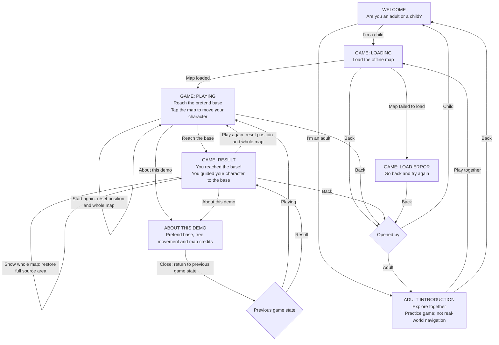
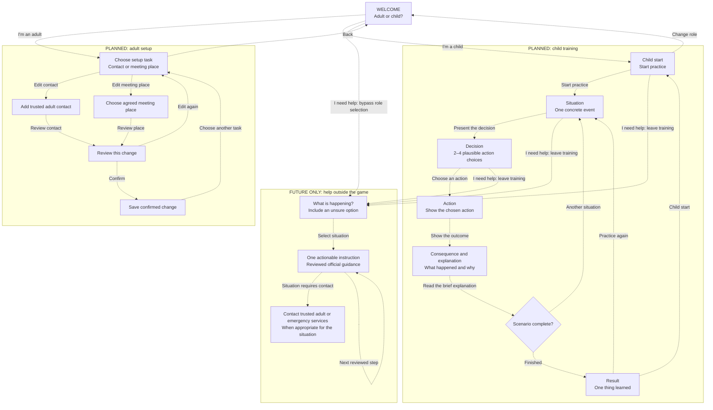

# Basebound screen and action reference

Updated: 2026-10-03. Android is the application; the Slidev screens are pitch prototypes.

## Implemented Android flow

Solid arrows describe working navigation or game actions. Result, loading and error are states of the game screen. “Back” returns to the screen that opened the game. Role selection changes the journey; it is not age verification or access control.

| Screen/state | One primary task | Secondary actions |
| --- | --- | --- |
| Welcome | Choose child or adult | None |
| Adult introduction | Start playing together | Back to welcome |
| Game loading | Wait for the map | Back |
| Game playing | Move the character to the pretend base | Pan/zoom, show whole map, restart, demo information, back |
| Game result | Read the result and replay | Pan/zoom, show whole map, demo information, back |
| Game load error | Return and reopen the game | Back |
| Demo information | Read optional demo details | Close |

Keep the map attribution visible. The square overview covers the same geographic extent as the offline source. The child view is deliberately schematic: broad park/water shapes, a few main roads and illustrated landmarks instead of a dense street map. Minor streets/buildings/POIs are omitted, and secondary labels appear only when space permits. Decorative trees and illustrated buildings are not exact real-world positions or outlines. Dragging or pinching explores the map without selecting a movement destination; only a resolved tap moves the character. Zoom buttons and Show whole map are secondary controls, disabled while loading or after a load error. Instructions and attribution stay outside scrolling areas. Only secondary controls can scroll; the map has its own gesture area. Short or large-text layouts use a shorter instruction, and landscape places the map beside the instructions and controls. Water, energy and warmth cards are removed because they do not affect this demo. There is one restart control in each loaded game state. Detailed geography and licensing information live in the information dialog.

## Proposed future product flow — not implemented

Dashed arrows describe future work, not features available in Android. Keep adult setup separate from child play. Each adult setup screen asks for one piece of information. Do not add a dashboard to the welcome screen.

The future help entry must be reachable without completing onboarding. It must use different styling from training, omit scores and entertainment, and follow situation-specific guidance from authoritative sources. This diagram defines navigation, not emergency procedures. Help is absent from Android today; the pitch includes a simulated preview that does not assess danger or make calls.

The first implementation slice is the solid-arrow Android flow. Family-plan storage, branching emergency scenarios, walking mode, real navigation and real assistance remain future work.

## Keeping this reference useful

Update the implemented graph when a screen, action or return path changes. Promote future nodes only when their behavior works. Use [UX.md](UX.md) for product principles and [UX_REVIEW.md](UX_REVIEW.md) for the review behind this simplification.
