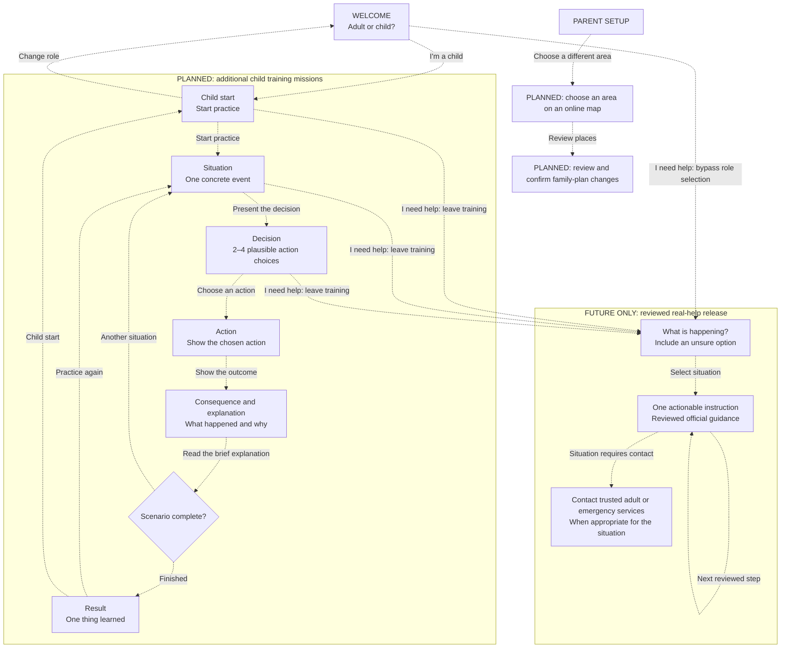

# Safe Path screen and action reference

Updated: 2026-10-03. Android is the application; the Slidev screens are pitch prototypes.

## Implemented Android flow

Solid arrows describe working navigation and actions. Loading, result and error are screen states. Role selection changes the journey; it is not age verification or access control. Parent onboarding is freely accessible in this demo. It asks for one action or piece of information per screen.

```mermaid
flowchart TD
    BOOT["FIRST LAUNCH<br/>Seed fictional demo map; preserve saved records"]
    BE["STARTUP ERROR<br/>Retry; saved records remain intact"]
    W["WELCOME<br/>Ask foreground location once; choose adult or child"]
    BOOT -->|Ready| W
    BOOT -->|Initialization failed| BE
    BE -->|Retry| BOOT
    BOOT -->|I need help| H
    BE -->|I need help| H
    A["PARENT INTRO<br/>Set up a family plan; demo details"]
    AL["SETUP: LOADING<br/>Read the encrypted local family plan"]
    AE["SETUP: LOAD ERROR<br/>Retry or explicitly delete saved details"]
    CN["CHILD NAME<br/>Optional full name"]
    CA["CHILD AGE<br/>Optional age"]
    CD["CHILD ADDRESS<br/>Optional address"]
    CS["CHILD SUPPORT NEEDS<br/>Optional notes; save child record"]
    CT["TRUSTED CONTACTS<br/>Add or review up to 3 contacts"]
    T["CONTACT NAME<br/>Optional name"]
    TP["CONTACT PHONE<br/>Optional phone number"]
    TR["CONTACT RELATIONSHIP<br/>Optional relationship; save contact"]
    SP["SAFE PLACES<br/>Add or review optional destinations"]
    M["SAFE PLACE NAME + ICON<br/>Optional name; choose emoji"]
    MP["SAFE PLACE PIN<br/>Choose a position on the offline map; save place"]
    ME["PLACE: MAP ERROR<br/>Go back and try again"]
    DONE["SETUP COMPLETE<br/>Start practice or review family details"]
    SE["FORM: SAVE ERROR<br/>Keep edits and retry on the same step"]
    DEL["DELETE CONFIRMATION<br/>Delete entry or all saved details"]
    F["OUR MAP: LOADING<br/>Read saved photo landmarks and named parent places"]
    FE["OUR MAP: LOAD ERROR<br/>Retry without resetting saved records"]
    L["OUR MAP: LOADING<br/>Load the offline map"]
    G["OUR MAP<br/>Independent emoji/photo pins, nearby landmarks and GPS walking guidance"]
    R["NEAR PLACE<br/>Accurate GPS is within 20 m; child confirms recognition"]
    E["OUR MAP: MAP ERROR<br/>Go back and try again"]
    I["ABOUT OUR MAP<br/>GPS, offline route limits and map credits"]
    H["HELP PROTOTYPE<br/>Unreviewed; not for real emergencies<br/>3 situations + I don't know"]
    Q["OFFLINE HELP STEP<br/>One question or instruction<br/>112 dialler always available"]
    D["PHONE APP<br/>Explicit child tap; no automatic call or SMS"]

    LP["PARENT: WALK TOGETHER<br/>Independent photo landmarks on the offline map"]
    PHOTO["ANDROID CAMERA OR GALLERY<br/>Choose one photo; cancellation saves nothing"]
    LN["LANDMARK NAME + ICON<br/>Name one recognisable place; choose emoji"]
    LPOINT["LANDMARK PIN<br/>Tap the map or explicitly use current GPS; confirm a demo-area pin"]
    LERR["LANDMARK LOAD ERROR<br/>Retry without resetting saved records"]
    A -->|Walk together, without completing setup| LP
    DONE -->|Walk together| LP
    LP -->|Load demo landmarks: add missing fictional points| LP
    LP -->|Take a photo: choose camera or gallery| PHOTO
    PHOTO -->|Photo chosen| LN
    PHOTO -->|Cancel| LP
    LP -->|Edit a saved landmark| LN
    LN -->|Choose map position| LPOINT
    LPOINT -->|Back: retain name and chosen pin| LN
    LN -->|Back without saving| LP
    LPOINT -->|Save name, photo copy and pin| LP
    LPOINT -->|Save failed: retain edits and retry| LPOINT
    LPOINT -->|GPS denied, unavailable or outside map: choose manually| LPOINT
    LP -->|Photo pin: view detail; edit or confirmed delete| LP
    LP -->|Confirmed Delete all landmarks| LP
    LP -->|Back: return to parent opener| LRETURN{"Opened by"}
    LRETURN -->|Introduction| A
    LRETURN -->|Completion| DONE
    LP -->|Load failed| LERR
    LERR -->|Retry| LP

    W -->|I need help: bypass role selection| H
    F -->|I need help: defer game creation| H
    FE -->|I need help| H
    L -->|I need help: pause GPS and narration| H
    G -->|I need help: pause GPS and narration| H
    R -->|I need help: pause GPS and narration| H
    E -->|I need help: pause GPS and narration| H
    H -->|Select situation| Q
    Q -->|Answer or next instruction| Q
    Q -->|Back: previous instruction| Q
    Q -->|Back from first step| H
    H -->|Close: restore opener; fresh GPS if enabled| HP{"Help opened by"}
    HP -->|Welcome| W
    HP -->|Target selection| F
    HP -->|Saved-details error| FE
    HP -->|Map loading| L
    HP -->|Playing| G
    HP -->|Result| R
    HP -->|Map error| E
    H -->|Open 112 dialler| D
    Q -->|Explicit 112 or saved trusted-contact action| D
    D -->|Return: no connection assumed| DP{"Previous help screen"}
    DP -->|Situation selector| H
    DP -->|Instruction| Q
    W -->|I'm an adult| AL
    AL -->|Details loaded| A
    AL -->|Read failed| AE
    AE -->|Retry loading| AL
    AE -->|Delete all saved details| DEL
    W -->|I'm a child| ON["CHILD ONBOARDING: NAME<br/>Name or nickname; saved details prefilled"]
    ON -->|Add my age| OA["CHILD ONBOARDING: AGE<br/>Enter age 1–99"]
    OA -->|Choose my character| OG["CHILD ONBOARDING: GENDER<br/>Girl or boy with character previews"]
    OG -->|Start practice: save encrypted local details| PS["ACTIVITY SELECTION<br/>Practices or Our map"]
    OG -->|Save failed: retain edits and retry| OG
    OA -->|Back| ON
    OG -->|Back| OA
    ON -->|Back| W
    PS -->|Our map| F
    PS -->|Practices| SC["PRACTICE SCENARIOS<br/>Alarm practice or I’m lost practice"]
    SC -->|Back| PS
    SC -->|Alarm practice: ages 7+| MODE["CHOOSE SCENE<br/>At home or outside"]
    MODE -->|Back or Choose a scenario| SC
    MODE -->|At home| HOME["HOME ALARM TUTORIAL"]
    MODE -->|Outside| OUT["OUTDOOR ALARM SIMULATION"]
    HOME --> MR["MISSION RECALL<br/>Completion sticker; no score"]
    OUT --> MR
    MR -->|Replay| RE{"Selected mission mode"}
    RE -->|Home| HOME
    RE -->|Outside| OUT
    HOME -->|Back| SC
    OUT -->|Back| SC
    MR -->|Back to practice choices| SC
    subgraph LOST["MISSION 02: FICTIONAL LOST PRACTICE, AGES 7+"]
        LL["LOAD PRACTICE FAMILY<br/>Read current encrypted record; display-only snapshot"]
        LE["READ ERROR<br/>Retry or explicitly use pretend family; preserve record"]
        LV["CHOOSE LOST SCENE<br/>Meeting point nearby or out of sight"]
        LS["STOP<br/>Stop instead of running or leaving"]
        LO["LOOK<br/>Remember the same configured landmark illustration"]
        LP["NEARBY POINT<br/>Recognize it; pretend short movement"]
        LN["POINT OUT OF SIGHT<br/>Stay nearby and ask for help"]
        LH["HELPER<br/>Ask staff at a visible public desk"]
        LU["STAY HERE<br/>Decline leaving with an unknown person"]
        LC["FAMILY CARDS<br/>Choose a pretend call"]
        LA["NO ANSWER<br/>Stay; try a different trusted person"]
        LR["PRETEND REPLY<br/>Family knows the story location"]
        LW["WAIT<br/>Stay with staff"]
        LJ["REUNION<br/>Parent arrives in the story"]
        LI["I'M SAFE<br/>Explicit tap; local training state only"]
        LD["PRETEND CONFIRMATION<br/>No message was sent"]
        LRC["LOST RECALL<br/>Seven actions; no score"]
        LF["LOST COMPLETE<br/>Replay or return to practice"]
        LL -->|Loaded; missing optional details use labelled fixtures| LV
        LL -->|Read failed| LE
        LE -->|Try again| LL
        LE -->|Use pretend family| LV
        LV -->|Choose variant| LS
        LS -->|Safe choice; acknowledge feedback| LO
        LO -->|Nearby variant| LP
        LO -->|Out-of-sight variant| LN
        LP --> LH
        LN --> LH
        LH --> LU
        LU --> LC
        LC --> LA
        LA --> LR
        LR --> LW
        LW --> LJ
        LJ --> LI
        LI -->|I'M SAFE; no communication| LD
        LD --> LRC
        LRC --> LF
        LF -->|Play again: retain variant and display snapshot| LS
    end
    SC -->|I'm lost practice; ages 7+| LL
    LOST -->|Back or exit: stop narration| SC
    LF -->|Back to practice choices| SC
    PS -->|Back| B
    A -->|Add child details| CN
    A -->|Skip child details| CT
    CN -->|Next: may leave empty| CA
    CA -->|Next: may leave empty| CD
    CD -->|Next: may leave empty| CS
    CS -->|Save child record| CT
    CT -->|Add or edit contact| T
    T -->|Next: may leave empty| TP
    TP -->|Next: may leave empty| TR
    TR -->|Save contact| CT
    CT -->|Choose safe places or Skip contacts| SP
    SP -->|Add or edit safe place| M
    SP -->|Add or edit practice meeting point| PMI["PRACTICE LANDMARK PICTURE<br/>Fountain or information desk"]
    PMI -->|Name this meeting point| PMN["PRACTICE LANDMARK NAME<br/>Optional label; same picture used in lost practice"]
    PMN -->|Save practice meeting point| SP
    PMN -->|Back| PMI
    PMI -->|Back: discard unsaved edits| SP
    PMN -->|Save failed: retain edits| SE
    M -->|Choose position| MP
    MP -->|Save safe place after choosing a pin| SP
    SP -->|Finish setup or Skip safe places| DONE
    DONE -->|Play together| PS
    DONE -->|Review setup| A
    CA -->|Back| CN
    CD -->|Back| CA
    CS -->|Back| CD
    CN -->|Back: discard unsaved child edits| A
    TP -->|Back| T
    TR -->|Back| TP
    T -->|Back: discard unsaved contact edits| CT
    MP -->|Back| M
    M -->|Back: discard unsaved place edits| SP
    CT -->|Back| A
    SP -->|Back| CT
    DONE -->|Back| SP
    CS -->|Save failed| SE
    TR -->|Save failed| SE
    MP -->|Save failed| SE
    SE -->|Retry from retained editor step| RETRY{"Editor being saved"}
    RETRY -->|Child| CS
    RETRY -->|Contact| TR
    RETRY -->|Safe place| MP
    RETRY -->|Practice meeting point| PMN
    MP -->|Map load failed| ME
    ME -->|Back| M
    CT -->|Delete contact or all saved details| DEL
    SP -->|Delete safe place or all saved details| DEL
    A -->|Location in Setup options: explicit permission retry or Android settings| A
    A -->|Delete all saved details| DEL
    DONE -->|Delete all saved details| DEL
    DEL -->|Keep or persist entry removal| RETURN{"Previous onboarding step"}
    RETURN -->|Intro| A
    RETURN -->|Contacts| CT
    RETURN -->|Safe places| SP
    RETURN -->|Completion| DONE
    DEL -->|Delete all: persist removal| A
    A -->|Back| W
    F -->|Load map geography| L
    F -->|Read failed| FE
    FE -->|Try again| F
    L -->|Map loaded| G
    L -->|Map load failed| E
    E -->|Try again| F
    G -->|Tap photo pin, nearby landmark or place list: open details only| G
    G -->|Fresh precise GPS: show nearest photo landmark within 50 m| G
    G -->|Calculate or replan path| SEARCH["FINDING A PATH<br/>Dinosaur with spyglass; cancel available"]
    SEARCH -->|Path or no-path result ready| G
    SEARCH -->|Cancel calculation| G
    G -->|Automatic foreground GPS; no permission prompt| GPS["GPS STATE<br/>Waiting, live, approximate, denied, disabled, stale or outside map"]
    GPS -->|Fresh position: update dot and route progress| G
    GPS -->|No valid position: no invented dot or active directions| G
    G -->|Walk here together: selected real place and precise in-area GPS| NAV["WALKING GUIDANCE<br/>Offline path + upcoming turn, metres and photo destination"]
    NAV -->|GPS follows path: advance turn cues| NAV
    NAV -->|Accurate GPS more than 25 m off route: replan| NAV
    NAV -->|No connected route: explain; no straight-line substitute| G
    NAV -->|Old, approximate or outside GPS: pause guidance| G
    NAV -->|GPS within 20 m of original pin; accuracy at most 20 m| R
    R -->|I recognise this place: stop directions; show feedback| G
    NAV -->|Stop directions| G
    G -->|Drag to pan; pinch to zoom 1–8×; GPS never changes camera| G
    G -->|Places: open accessible place selection| G
    G -->|About our map| I
    R -->|About our map| I
    I -->|Close| G
    NAV -->|I need help: pause GPS and narration| H
    HP -->|Walking guidance: obtain a fresh GPS fix| G
    F -->|Back| B{"Opened by"}
    FE -->|Back| B
    L -->|Back| B
    G -->|Back| B
    R -->|Back| B
    E -->|Back| B
    B -->|Our map| PS
    B -->|Practice opened by child| W
    B -->|Practice opened by adult| DONE
```

| Screen/state | One primary task | Secondary actions |
| --- | --- | --- |
| First-launch loading/error | Prepare three photo landmarks and fictional Home | Retry on failure; Help prototype; existing records preserved |
| Welcome | Foreground location permission once, then choose child or adult | Denial permits navigation; Help prototype, without choosing a role |
| Child onboarding | Enter name or nickname, age, then select girl or boy | Back keeps edits; load/save errors allow retry; saved details are prefilled |
| Activity selection | Choose Practices or Our map | Replay audio, back |
| Practice scenarios | Choose alarm or lost practice | Replay audio, back to activities |
| Mission mode (7+) | Choose home or outside | Replay audio, back to scenarios |
| Mission scene | Tap a highlighted scene object to choose an action, or hear the situation | Replay audio, back |
| Mission feedback | See the consequence and explanation | Retry the same decision or advance; replay audio |
| Mission recall | See the six learned actions and completion sticker | Replay audio, replay mission, choose practice |
| Lost practice loading/error | Load the current display-only family snapshot | Retry or explicitly use pretend family; back preserves saved details |
| Lost scene selection (7+) | Choose meeting point nearby or out of sight | Replay audio, back; unavailable voice offers adult help and retry |
| Lost decision/feedback | Tap a highlighted person, object or landmark; hear a calm consequence | Retry unsafe choice or advance; replay audio, exit |
| Lost reunion/confirmation | Tap I'M SAFE after the fictional reunion | Explicit local confirmation; no message sent |
| Lost recall/completion | Recall seven actions, including meeting point only if nearby | Replay audio, Play again with the same snapshot/variant, Back to practice choices |
| Parent intro | Add child details | Walk together; Skip child details, demo/privacy details, confirmed Delete all and explicit location recovery in Setup options, back |
| Child name, age, address, support needs | Enter one optional detail per screen | Next with value or empty field, previous step; final step saves child record |
| Trusted contacts | Add or review up to three contacts | Edit or confirmed delete; Choose safe places or Skip contacts; Setup options, back to intro |
| Contact name, phone, relationship | Enter one optional detail per screen | Next with value or empty field, previous step; final step saves contact |
| Safe places | Add or review optional map places or a lost-practice landmark | Edit or confirmed delete; Finish setup or Skip safe places; Setup options, back to contacts |
| Practice landmark picture/name | Choose one bundled illustration, then an optional label | Previous step, save with retained edits on failure; back without saving |
| Safe place name | Name one safe place and choose an emoji icon | Choose position, back without saving |
| Safe place pin | Choose one geographic position | Tap or accessible centre/direction controls; save, previous step |
| Setup complete | Play together | Walk together; Review setup returns to intro; Setup options, back to safe places |
| Setup load error | Recover saved details | Retry, confirmed Delete all in Setup options, back |
| Form save error | Retry saving without losing edits | Back without saving |
| Our map loading/error | Load named places, photo metadata and offline map | Retry without resetting records; Help prototype, back |
| Our map | Select a familiar place or inspect the nearest landmark | Places selector, automatic foreground GPS, gesture pan/zoom, audio replay, info, Help prototype |
| Walking guidance | Follow the next mapped turn with an adult | Route distance, destination photo, stop directions, change destination |
| Near place | Confirm recognising the original photo place | Accurate GPS required; path endpoint alone does not confirm arrival |
| Map information | Read optional GPS and coverage details | Close |
| Parent landmark library | Add a photo of one familiar place | Camera/gallery choice, explicit Load demo landmarks, tap a pin for details, edit name/pin, confirmed delete or delete all, back to opener |
| Landmark name | Name the photographed place and choose an emoji icon | Choose map position, back without saving |
| Landmark pin | Confirm one position inside the demo map | Manual tap/accessible direction controls, optional foreground GPS, previous step; saving preserves edits on failure |
| Landmark load error | Retry reading saved landmarks | Back; no silent deletion or reset |
| Help prototype entry | Choose not responding, air raid, lost, or unsure | Open 112 dialler, no-signal information, close |
| Help step | Answer one question or read one instruction | Previous step, 112 dialler, trusted-contact dialler where offered |

Child onboarding stores name, age and optional serialized gender in the existing encrypted family record, preserving address, support notes, contacts and practice places. Older records without gender still load. The selected girl or boy appears in mission poses; the map uses a blue GPS dot; adult Play together also uses the saved character. Age entry is personalization, not age verification. Returning to the child route allows editing the three steps.

Each parent stage offers **Setup options → Delete all saved details**, with confirmation. Completed child, contact and safe-place editors save their records before returning; completing onboarding launches practice without an additional bulk save. **Review setup** returns to the intro and preserves saved records.

Help content is bundled. Phone-app launch is real, but no call, connection, rescue, SMS delivery or verified route is inferred. Not-responding skips parent contact and offers 112 immediately. The air-raid flow does not offer routine parent voice calls. No-signal medical guidance is incomplete. See [EMERGENCY_HELP.md](EMERGENCY_HELP.md) for sources and the review required before real use. Adult setup configures contacts; help only reads its encrypted local record. Opening help during target selection defers creation of the game until help closes.

### Mission 01 — air-raid alarm practice

The home tutorial practices alarm recognition, moving away from windows, choosing an interior hallway, messaging a fictional trusted adult, staying after a noise, waiting through silence, and following an explicit all-clear. The premise is a fallback when the agreed shelter cannot be reached. An interior area and two walls offer some protection; the game does not certify a home as safe.

The MVP targets children aged 7+ with two to four choices and optional fictional outdoor practice: compare nearby shelter against distant destinations and exposed places. Child onboarding collects age, but there is no younger-child branch; saved age does not change this mission. An outdoor mistake leads to getting down (drag or tap), protecting the head, and moving to shelter. Home mistakes explain the consequence and retry without punishment. Both modes finish with a visual recall and completion sticker, with no score or timer.

Instructions, feedback, and replay use an installed offline English Android speech voice. If unavailable, the app shows an adult-help message; text remains as a fallback. Short warning and all-clear playback excerpts are teaching samples, not complete alarm signals. Contacts, messages, replies, shelter selection and movement are fictional; this mission neither calls nor sends messages nor uses saved personal contacts or map pins. See [mission-01-air-raid-alarm.md](mission-01-air-raid-alarm.md) for the scenario and source notes.

### Mission 02 — lost practice

The new 7+ activity has two explicit variants: the agreed meeting point is visible nearby, or it is out of sight. Both practice stopping, looking, asking at a nearby public desk, declining to leave with an unknown person, a pretend call with no answer, trying a different contact, waiting, reunion, an explicit I'M SAFE tap and seven-action recall. Wrong choices get calm feedback and retry the same decision. There is no score or timer.

Parent setup can save a practice Fountain or Information desk illustration and optional label within the existing safe-places stage. This field is independent of geographic pins. The same registry supplies setup, reminder and recognition art; it is not a photograph or a safety assessment. Contacts contribute display labels/avatar motifs only. Calls, replies and notifications are simulated; the mission never receives real phone numbers, addresses or map coordinates. Missing details use labelled fixtures, and an unknown landmark ID becomes Pretend fountain. Failed record reads require retry or explicit fictional practice and never overwrite the record.

The lost selector and mission reuse offline English Android speech. Missing voice offers adult help and retry, with text retained. Leaving stops narration and returns directly to the scenario list; replay resets transient progress and keeps the selected variant/snapshot. Re-entering lost practice reloads current saved details. Training is labelled unreviewed and not for real emergencies. Meeting-point/contact photos, younger-child support, familiar routes and actual parent notifications remain future work for Mission 02. See [MISSION_02_IMPLEMENTATION_PLAN.md](MISSION_02_IMPLEMENTATION_PLAN.md) for scope, references and verification.

### Visual design system

The implemented screens follow [UI_GUIDELINES.md](UI_GUIDELINES.md): warm neutral backgrounds, slate Nunito text, one muted blue action accent, flat white panels and consistent 12-pixel control corners. Shared action tiles use small icons and left-aligned labels. Equivalent choices stay neutral until selected; feedback adds a symbol and explanation. No control uses a decorative gradient, glow or raised game-button treatment.

Welcome, child onboarding, activity selection and practice scenarios use clear headings and calm choices. The first child activity screen has two choices: **Practices** opens a separate scenario list; **Our map** opens the familiar-place map. Alarm and lost practice return to the scenario list, whose back action returns to activities. Maps and landmark photos remain the main content of their screens, with compact controls and preserved attribution. Adult onboarding uses a field-first layout with one detail per step, a compact progress indicator and a single save/next action. Help retains its separate cool theme, no training mascot and a visible prototype notice.

Mission 01 uses portrait environment backgrounds and a separate character layer. Decision targets highlight the pictured windows, doors, rooms and destinations, with readable captions and native labelled tap controls. Abstract actions and fictional contacts use separate illustrated targets within the scene. Mission 02 places selectable people, landmarks and action objects in its fictional square. Equivalent targets use the same neutral highlight before selection; feedback supplies the outcome colour and symbol. Training and adult-setup icons retain their original colours.

Narration and feedback stay outside the scene; next/retry actions remain below it. Narrow and large-text layouts allow scenes to grow or scroll while retaining at least 48-pixel touch targets. The hallway and two-wall explanation stays visible. Completion keeps replay and exit actions available. Narration, decisions, consequences, explanations and return paths are preserved.

The current activity split adds a separate scenario-list route to the implemented graph. Mission content and the future graph remain unchanged. Earlier verification records in [UI_IMPLEMENTATION_PLAN.md](UI_IMPLEMENTATION_PLAN.md) are historical; the current pass has its own integration checks.

### Child map interaction

**Our map** combines independent photo landmarks, saved named parent pins, recognition and walking guidance. Opening it shows the full bundled 2 × 2 km TAURON Arena, Kraków area, without an invented player position or random destination. Pins show a saved Unicode emoji instead of a number; photo landmarks also keep their thumbnail. Tap a pin to inspect its name/photo. **Walk here together** starts guidance to that selected real place. Fictional demo pins are for recognition only and have no walking action.

The welcome screen requests foreground location permission once on first launch before role navigation. Denial permits practice; explicit permission retry or Android settings access is available in parent Setup options. Welcome does not start location tracking. **Our map** starts foreground GPS automatically without requesting permission. Only received phone positions set the blue dot; the accuracy circle shows uncertainty. An accepted fix is at most 30 seconds old, and turn guidance requires reported accuracy at most 25 m. Approximate fixes may show a dot but pause directions. Old fixes remove both dot and route. Denied permission, disabled GPS, stream failure and out-of-area positions are explicit states. Out-of-area coordinates are never clamped onto the arena map. Backgrounding, leaving this screen or opening Help cancels GPS; returning while foreground obtains a fresh fix without another permission prompt. No background permission or location history is added.

The map stays north-up and starts with the whole area visible. Dragging and pinching are the only camera controls, with 1–8× zoom. GPS updates the dot and route without recentering or zooming. There are no GPS-toggle, zoom, recenter or overview buttons. An accessible **Places** selector opens on demand; a contextual panel shows exploration, the selected place or walking guidance. The closest photo landmark within 50 m appears beneath the map, or beside it in landscape. Photo markers retain a 48-pixel touch target at each zoom. Directions, map attribution and scrolling secondary controls remain outside the map gesture area. Landscape places controls beside the map. Appearance verification remains with the user.

Route calculation and replanning show a dinosaur with a spyglass and **Finding a path…** overlay, with Cancel available. A* runs off the UI isolate; cancellation, stale GPS, leaving or pausing discard late results. Routes use the existing offline pedestrian graph. Text and offline narration provide the next turn, path distance and names where available; turn directions are relative to the route, not phone orientation. A GPS fix over 25 m from the route replans. The endpoint ring marks a nearby mapped path, not a verified entrance. Reaching that ring alone does not mark arrival: accurate GPS must be within 20 m of the original pin to offer **I recognise this place**. Directions stop when confirmed. No connected path means a clear message, with no straight-line walking substitute. Access, barriers, entrances and current hazards are not verified; walk with an adult.

Functional verification covers GPS-only movement, denied/approximate/stale/out-of-area fixes, lifecycle cancellation, turn geometry/names, unavailable routes, offset endpoints and recognition on the shared map. Physical Android walking/GPS and appearance review remain unverified.

### Independent photo landmarks

Parents open **Walk together** directly from the family intro or setup completion. This name describes exploring together, not a recorded walk. Camera or gallery capture opens the existing parent form style: name and emoji icon, then map position. A landmark needs a non-empty short name and confirmed geographic pin. The app copies its photo out of the camera cache when saving. Editing retains its photo while changing the name, icon or position. Existing records without an icon use 📍. Back from the name step saves nothing; back from pin placement retains the draft.

Pins are independent recognition points, stored separately from safe places. There is no stored route, sequence, track or assumed visiting order. A child may select any real point for a route from their current GPS position. Landmark collections use the existing game geography, with photo markers, pan/pinch and accessible list selection. Camera/gallery is provided by Android rather than an invented in-app camera screen. Camera results interrupted by Android activity destruction are recovered when the parent reopens Walk together.

**Use my location** requests one foreground position only after the parent's explicit tap. Parents always confirm the map pin. Denied permission, disabled location, timeout and positions outside the bundled TAURON Arena map keep manual placement available. The app does not request background location or record a movement history.

On a fresh installation, startup automatically adds three generated fictional photos and independent fictional pins plus one **Home** practice place. Child details and contacts stay empty. Existing installations with saved records are preserved. Interrupted seeding can retry without duplicating points; after successful initialization, deleted records stay deleted. Home retains a fictional demo flag, including after edits, and cannot be selected for real walking guidance.

**Load demo landmarks** remains an explicit parent action to add missing generated photo landmarks: red shop, yellow slide and blue bus stop. Existing records and edited demo records are preserved; repeated imports add only missing demo IDs. Demo labels remain visible in lists, details and practice. These images do not depict the real map locations. Bundled source assets remain available after deleting saved copies, but they are not automatically restored.

Children choose **Our map** from activity selection to explore photos and locations. The nearest photo landmark within 50 m of precise, fresh live GPS is shown with its photo, saved emoji, name and approximate straight-line distance. Tapping its name opens the existing place details. Only one nearest landmark is shown; it updates as GPS moves. The card is hidden with no nearby landmark, approximate/stale/paused GPS or a position outside coverage. Fictional demo photos retain their label. Photo recall and numbered pin choices have been removed. Offline narration and replay remain available for walking instructions; nearby landmarks do not start routes or move the GPS dot.

Names, emoji icons, coordinates and photo references persist in a separate encrypted `flutter_secure_storage` record. Photos are ordinary app-private files, not encrypted by that metadata store. Parent **Delete all saved details** now removes the family record, landmark record and saved app photo copies; gallery originals remain untouched. The app has no parent lock, cloud sync or photo backup/restore promise. Live walking guidance is implemented only within the bundled map. Reviewed emergency assistance and validated pedestrian routing remain future work.

### Data and demo boundaries

- One child; optional full name, age, address and support notes, entered one detail per screen. The child record is saved after the support-needs step. Photo landmarks are separate recognition records; child-profile photographs are not collected.
- One optional practice meeting point; a bundled landmark illustration and display label, saved separately from map pins. Existing schema-v1 records without this field still load; deleting it preserves other entries. Lost practice reads display information only and uses no real communications.
- Up to three trusted contacts; optional name, phone and relationship, entered one detail per screen. Each completed contact and safe-place editor saves its record immediately. Back from the first editor step discards only unsaved edits. Saving a number does not make calls or verify it.
- Safe places are parent-selected destinations, stored as named geographic pins inside the bundled TAURON Arena area. Their safety and opening hours are not checked. Our map offers GPS-based walking guidance to selected named pins; it does not verify safety, access, entrances or emergency suitability.
- No random destination, fictional starting position, tap movement, automatic character movement or synthetic blockage controls remain. Parents may still tap to place a saved pin; that never moves a child’s location.
- The family plan persists in `flutter_secure_storage` using Android encryption. Android cloud backup and device-transfer rules exclude app data. No sync, migration or restore is promised.
- Encryption is not a parent gate: anyone using this unlocked app can view the records. Recommend fictional personal details for demonstrations. **Delete all saved details** removes child/contact/place records, independent landmarks and app photo copies after confirmation; it does not silently reset failed reads.
- Keep map attribution visible. Keep GPS walking guidance distinct from fictional alarm/lost training. Missions 01 and 02 implement fictional alarm and lost decision training; validated real emergency assistance remains unimplemented. The separate help prototype is unreviewed.

## Proposed future product flow — not implemented

Dashed arrows describe future work. Keep adult configuration separate from child training. Online area selection, multi-device sharing and protected parent access are not available in this demo.

The future help entry must be reachable without completing onboarding. It must use different styling from training, omit scores and entertainment, and follow authoritative situation-specific guidance. This diagram defines navigation, not emergency procedures. Android now has an explicitly unreviewed help prototype, not released real assistance. The pitch still includes a simulated preview that does not assess danger or make calls.

Full reviewed emergency procedures, background messaging, worldwide map coverage and validated real assistance remain future work. The current GPS walking mode is limited to the bundled arena area and unverified OSM access data. The implemented prototype is not a promotion of the future reviewed-help graph.

## Offline walking pathfinding

The Android map builds a distance-and-preference-weighted graph from bundled GeoJSON and runs A* locally. Routing needs no service or internet connection. Its source is the current accurate foreground GPS fix; no virtual character moves. Shared source coordinates connect ways; visual intersections do not create connections. Line segments are subdivided for accurate nearby snapping without connecting their interior crossings. Polygons are not treated as walkable networks.

| Algorithm | Fit for this demo |
| --- | --- |
| Breadth-first search | Finds the fewest edges, not the shortest distance when segments have different lengths. |
| Dijkstra | Correct for positive distance costs; useful for many destinations from one start, but explores without a target heuristic. |
| A* (implemented) | Uses weighted distance travelled plus straight-line distance to the goal. The heuristic stays admissible because all preference multipliers are at least one. Suitable for one practice target. |
| Grid / navigation mesh | Useful for fictional terrain with authored obstacles; rasterizing this street map could invent connections or erase narrow paths. |

Algorithm references: [Boost shortest-path overview](https://www.boost.org/doc/libs/latest/libs/graph/doc/html/graph/algorithms/shortest_paths/shortest_paths_overview.html), [A*](https://www.boost.org/doc/libs/latest/libs/graph/doc/html/graph/algorithms/shortest_paths/astar_search.html), [breadth-first traversal](https://www.boost.org/doc/libs/latest/libs/graph/doc/html/graph/algorithms/traversal/traversal_overview.html).

The local walking routing profile includes footpaths, steps and public local roads. It excludes main roads, indoor ways, construction, non-public walking access, conditional access that the offline demo cannot evaluate, and any non-`no` `hazard` tag. `foot=use_sidepath` is excluded; the router must use the separately mapped path. General access restrictions may be overridden by explicit `foot=yes/designated/permissive`; cycleways require explicit foot permission. Explicit walking one-way direction is honored; vehicle one-way rules do not apply to foot travel. This is a demo policy, not a complete pedestrian access or safety model. OSM tag meanings: [access](https://wiki.openstreetmap.org/wiki/Key:access), [foot permissions](https://wiki.openstreetmap.org/wiki/Tag:foot%3Dyes), [hazards](https://wiki.openstreetmap.org/wiki/Key:hazard).

Preference costs multiply map distance: dedicated pedestrian paths 1.0, roads with an explicitly attached sidewalk 1.05, living streets 1.1, crossing paths 1.15, steps 1.2, local roads with unknown or separately mapped sidewalks 1.35, and roads explicitly lacking sidewalks 1.6. These are transparent fictional demo preferences, not seconds, risk probabilities, or validated emergency policy. A modest pedestrian detour can win; a sufficiently shorter eligible local road can also win. No route is described as fastest or safest.

Start and target must each be within 12 map units (about 60 m) of a graph node. The route starts/ends on nearby mapped paths, with no invented connectors to GPS or a photo pin. A start more than 15 m from the route asks the child to find the path with their adult. Missing/disconnected paths show a calm message. The pin and the endpoint ring remain separate.

GPS fixes drive progress along the directed route. Significant geometry bends produce left/right/back cues; OSM names, steps and crossings enrich the instructions. Turn cues use route direction, not device orientation. Accurate positions more than 25 m off the mapped line trigger a new A* route. Narration plays on route creation and approaching turns; Replay audio reads the current instruction. GPS and turn guidance pause outside coverage, on stale/approximate fixes and while Help is open.

The snapshot lacks original OSM node IDs, validated access, entrance connections, barrier handling and live hazards. Coordinate-based topology and nearby snapping can select the wrong path or leave a pin unreachable. Live GPS does not validate those limitations. Routes must not be described as fastest, safest, verified shelter access or real emergency guidance. The application keeps the adult-accompaniment instruction visible.

## Keeping this reference useful

Update the implemented graph when a screen, action or return path changes. Promote future nodes only when their behavior works. Concurrent map/help branches must reconcile their implemented flows at integration. Use [UX.md](UX.md) for product principles and [UX_REVIEW.md](UX_REVIEW.md) for the earlier simplification review.
